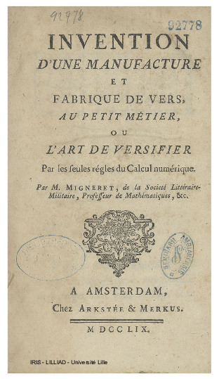

In February 2023, just a few months before he died, my dear friend Antoine de Falguerolles sent me an email
and a 1759 pamphlet by Pierre-Jean Migneret, *Invention d'une Manufacture et Fabrique de Vers, au Petit Métier,
ou l'Art de Versifier par les Seules Règles du Calcul Numérique*,
that he said might be "the first pamphlet against ChatGPT", but, characteristically, framed it as "a non-serious contribution".
But, when I translated and read this, I thought, "holy molly, it actually anticipates so many aspects of modern AI,
that it is worth a closer look."

This was so typical of Antoine. He got me interested in the history of data visualization the first time we met in Toulouse,
showing me the 1864 volume of the _Albums de Statistique Graphique_, containing statistical graphics I never thought existed.
We later formed _Les Chevaliers_ to purchase an entire collection of these albums, published by the Ministery of Public Works
in France, 1879--1899. Over many years, Antoine would toss me many, many historical nuggets: the address in Paris, where
Charles Joseph Minard lived in Paris (32 rue du Bac); where Minard was buried (Montparnasse Cemetery, Paris);
the remarkable contributions of André-Louis Cholesky and so on.

I could go on. But the point is not the list. It's the cast of mind behind it: the statistician and historian who kept finding things that mattered, and sharing them with characteristic lightness. This one, it turns out, mattered more than either of us realized.

## Migneret and his pamphlet

Pierre-Jean Migneret was a mathematics teacher and accountant, but not, as far as we know, a famous one. By 1798 he had
published a textbook on commercial arithmetic; the 1759 pamphlet is his one brush with something larger. The full title
announces it cheerfully: *Invention d'une Manufacture et Fabrique de Vers, au Petit Métier, ou l'Art de Versifier par
les Seules Règles du Calcul Numérique* — a factory for making verses, on a small loom, by the rules of arithmetic alone.
Isn't that ChatGPT without the loom?

::: {style="float: left; margin: 0 1.5em 1em 0; width: 35%;"}

:::

The fancy title page says "Published by Arkstée & Merkus, Amsterdam, 1759". Except it wasn't Amsterdam, and Arkstée & Merkus didn't publish it. (They were real publishers, operating in Amsterdam and Leipzig — but the address was a standard precaution for a pamphlet
that might offend someone.)

The brief preface — the *Avertissement* — is candid about how this thing came to exist. Migneret had planned something
grander, a large folio volume. The printer talked him down: "even if your book were a foolish trifle (*une sottise*)
of the moment, I'd be sure to sell it" — provided it came as a slim brochure. A fire then destroyed his larger plans
anyway. He accepted the smaller format. But notice: Migneret adopts the printer's word *sottise* without a trace of
embarrassment. He's advertising his own work as a learned trifle. The satirical intent is declared on the very first page.

What is Migneret actually arguing? He states his thesis directly, around page 7:

> *Les prêtres des payens ne forgeoient pas non plus les oracles. Ils ne faisoient que les tirer d'une table numérique,
> & la combinaison résultante de diverses opérations arithmétiques, faisoit avoir une réponse vaguement relative au
> sujet de la question.*

Translated:

> The pagan priests did not *invent* the oracles. They merely drew them from a numerical table; the combination resulting
> from various arithmetical operations then produced a response vaguely related to the subject of the question. Oracle
> responses were, in his phrase, *"réponses vagues, accommodées à l'alternative de l'événement"* — vague answers
> calibrated to fit either outcome.

This is Enlightenment demystification in the tradition of Fontenelle's *Histoire des Oracles* (1687), which Migneret
cites explicitly. But Fontenelle had *argued* that oracles were fraud; Migneret goes a step further and *demonstrates
the mechanism*. His pamphlet contains a working algorithm — a proof of concept that anyone can operate. Migneret knew
exactly what he had done. Buried in the preface is a quiet boast: the best mathematicians of his day would perhaps have
declared it *impossible* to produce Latin verses by arithmetic. He pulled it off anyway.

## The Oracle at work

Let's see what the machine actually produces. Antoine worked through two examples with a question posed to the
Oracle, and its' response, both in Latin:

| Question | Oracle response |
|----------|----------------|
| *Celui que j'aime deviendra-t-il mon époux?* | *Ecce equidem licitæ prædicit talia numen.* |
| *La paix sera-t-elle prochaine et avantageuse aux Français?* | *Credo satis licitæ, donabit fœdera numen...* |

Translated:

Will the one I love become my husband? — *Behold, the god foretells such things as are permitted.*

Will peace be near and advantageous to the French? — *I think it fair enough; the god will grant a treaty.*

Both answers are perfectly oracular: confident-sounding, Latin, and applicable to almost anything.

Here is how Migneret built this. The *Instruction sur la manière de travailler* (pp. 28–34) walks through every step.

**Step 1 — Normalize the question to exactly nine words.** The example question becomes: *Celui que j'aime deviendra-t-il cette année mon époux?*

**Step 2 — Encode each letter as a number.** Migneret's *Table Alphabéti-Numérique* assigns A=1, B=2, … Z=23 (no J, no W, no X — the table follows 18th-century French orthography). Letters within each word are summed:

```
C    e    l    u    i
3    5   11   20    9   →  48

q    u    e
16   20    5          →  41

j    a    i    m    e
9    1    9   12    5   →  36

… and so on for all nine words …
```

**Step 3 — Compress each score modulo 9.** Divide by 9, keep the remainder; a remainder of zero becomes 9:

```
Word        sum   mod 9
Celui        48     3
que          41     5
j'aime       36     9   (0 → 9)
 …            …     7
 …            …     2
 …            …     6
 …            …     1
 …            …     3
 …            …     3
             ─────────────
nine-digit key:  3  5  9  7  2  6  1  3  3
```

**Step 4 — Build the triangle.** Apply the same mod-9 operation to adjacent pairs, row by row, building a downward triangle of 9 rows:

```
3 5 9 7 2 6 1 3 3
 8 5 7 9 8 7 4 6
  4 3 7 8 6 2 1
   7 1 6 5 8 3
    8 7 2 4 2
     6 9 6 6
      6 6 3
       3 9
        3
```

**Step 5 — Read nine index values** from the nine columns of the triangle.

**Step 6 — Look up the verse.** Each index points to a pre-composed Latin hexameter fragment in Migneret's tables; the nine fragments are concatenated into the oracle response.
