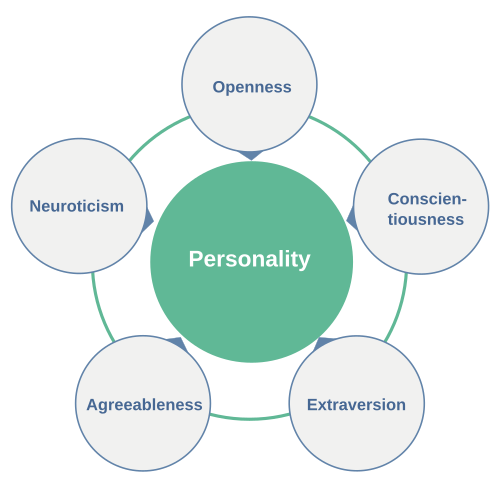

The hotel sits right on the Mediterranean. From my room I can see both: the
pool, gleaming and rectangular and turquoise, populated by orderly sunloungers
and a swim-up bar; and beyond it, the beach, stretching in both directions,
messy and vast and indifferent to my presence.

It is 10am. I have to choose.

This, I realize, is not merely a lifestyle decision. It is a psychometric
instrument and perhaps a personality test in disguise.

---

## The Question

When both are available, equally accessible, and the weather is perfect —
which do you choose? No excuses permitted. Not "the beach has jellyfish today"
or "the pool is too crowded." Conditions are controlled. The choice is pure.

Beach or pool?

Your answer, I suspect, says something real about you.

---

## What Each Option Actually Offers

They are not the same thing with water. They are fundamentally different
environments, and the differences are systematic.

**The pool offers:**

- Temperature you can predict before you get in
- Water you can see through to the bottom
- A defined, bounded space with legible social rules
- No waves, no salt, no sand in awkward places
- A bar at one end, a shallow end at the other, and nothing unknown

**The beach offers:**

- Wildness — scale, horizon, the sense of something that was here long before you and will be here long after
- Salt water: more buoyant, more sensory, more alive
- Waves — rhythmic, unpredictable, occasionally rude
- Sand, which is either a pleasure or an abomination depending on who you are
- Anonymity — you are one small person at the edge of something enormous

The pool is a controlled environment. The beach is not, and that is either
its appeal or its problem.

---

## Beachiphilia and Its Dimensions

This brings us to a concept BS has been developing: *beachiphilia* — the
love of the beach, and all that comes with it. Not everyone has it equally.
Some people are genuine beachiphobes, who find the sand invasive, the horizon
anxiety-inducing, and the absence of a controlled water temperature frankly
alarming. This is a legitimate position.

Some people are drawn to the beach the way others are drawn to mountains or
cities; it is a genuine dimension of personality, not just a leisure
preference.

The beach-vs-pool question is a clean operationalisation of one facet of
beachiphilia: tolerance for, or active preference for, the uncontrolled. The
beach is bigger, wilder, saltier, sandier, and less predictable than the pool.
Choosing it means choosing all of that. Choosing the pool means preferring
the edited version.

But beachiphilia is not a simple binary, and neither are beaches. There are
really two dimensions to the beach-or-pool choice: **psychological** and
**physical**.

The psychological dimension is what the rest of this post is about: openness
to experience, sensation-seeking, tolerance for disorder. This is relatively
stable across beaches.

### Physical dimensions

The physical dimension is more contingent — and easily overlooked. Beaches
vary enormously in what they actually offer, and this variation shapes the
choice in ways that have nothing to do with personality:

- **Sand**: ultra-fine and powdery (the Caribbean ideal), coarse and gritty
  (bracing), sharp pebbles (character-building), or large rocks (an acquired
  taste).
- **Water**: flat and glassy, gentle ripples, proper waves, or full surf —
  each a different physical contract with the sea.
- **Colour**: luminous turquoise, deep Mediterranean blue, or grey North Sea
  (which requires a different kind of enthusiasm entirely)
- **Amenities**: a beach bar within reach, clean facilities, phone signal for
  those who need it.
- **Getting there**: a five-minute walk from your room, a thirty-minute drive
  to find parking, a water-taxi, an excursion boat — each adding its own
  cost-benefit calculation before you have even touched the water.

A true beachiphilia scale would need to account for both dimensions. Someone
who says "I prefer the pool" at a North Sea resort in October may be a
passionate beach person who simply found the specific beach unappealing —
not a pool person at all. The measurement problem is to separate the
preference for beach-in-general from the preference for this-particular-beach-
today.

---

## The Personality Connection

If you were running this as a proper study, you would administer the Big Five
personality inventory alongside the beach-vs-pool question. My predictions:

{style="float:right; margin-left:1.5em; margin-bottom:1em; width:45%"}

**Openness to experience** — the strongest predictor. Beach people score
higher. The beach demands a certain willingness to be surprised, to accept
sand and salt and waves on their own terms. Pool people may prefer their
environment more curated.

**Neuroticism / need for control** — pool people may score modestly higher.
Not because they are anxious, but because the pool's predictability is
genuinely appealing to people who like to know what they are getting into.
Literally.

**Sensation seeking** — beach people higher. Waves are stimulating in a way
still water is not. The beach engages more senses simultaneously: sound,
smell, movement underfoot, the thermal variability of sand and water and
breeze.

**Extraversion** — less clear. Pools have a more structured social
environment; beaches are more anonymous. The relationship probably depends on
what kind of socialising you are after.

**Conscientiousness** — possibly higher in pool people. You are less likely
to leave the pool with sand in your belongings, which requires a certain
tolerance for disorder.

These are priors, not findings. The study would be the update.

---

## The Age and Life Stage Effect

The beach-vs-pool preference is probably not stable across a lifetime.

With young children, the pool wins almost automatically: shallower, bounded,
visible bottom, no waves to knock anyone over, easier to keep track of small
people. The beach is wonderful but requires a higher vigilance tax.

In middle age, the choice may reflect the personality dimensions most clearly
— the signal is least contaminated by practical constraints.

In older age, a different pragmatism sets in. Salt water's extra buoyancy
becomes an asset. The pool's steps and railings become relevant. The beach's
uneven terrain becomes either invigorating or inconvenient.

A clean study would measure beach-vs-pool preference alongside age, life
stage, and personality — and fit a model that separates the personality
signal from the practical constraints. The interaction between age and
openness to experience would be the interesting term.

---

## A Further Wrinkle: The Switcher

There is a third type, underrepresented in the binary framing: the person
who starts at the beach and migrates to the pool by mid-afternoon, or vice
versa. They are optimising across time rather than making a single choice,
and their behaviour encodes something different again — perhaps higher
flexibility, perhaps indecision, perhaps simply a longer planning horizon.

A full beachiphilia scale would need to capture this. Not just *beach or
pool* but *when, in what weather, with whom, for how long, and in what order*.

The measurement problem is, as always, more interesting than it first appears.

---

## How Would You Study It?

The cleanest design: a hotel on the beach, a pool, and a willing sample of
guests. On arrival, administer the Big Five and a short beachiphilia
questionnaire. Over the course of the stay, observe (or ask about) daily
choices: beach, pool, or both. Record time of day, weather, who they are
travelling with, and age.

The outcome variable is not a single choice but a pattern across days — a
proportion, or a trajectory. Some people are consistent; some switch. The
variance in switching behavior is itself informative.

**Analysis**: 
* Model: multilevel logistic regression, with daily choice nested within
person. 
* Predictors: Big Five scores, age, party composition (solo, couple,
family), weather. 
* The random effects structure would show how much of the
variance is stable personality versus day-to-day circumstance.

The field site is pleasant. The data collection involves sitting by either a
pool or a beach. Ethics approval should be straightforward.

---

*I chose the beach. I always choose the beach. This may itself be a data
point, though I am not sure it is a surprising one. Only the beach encourages
BS.*
