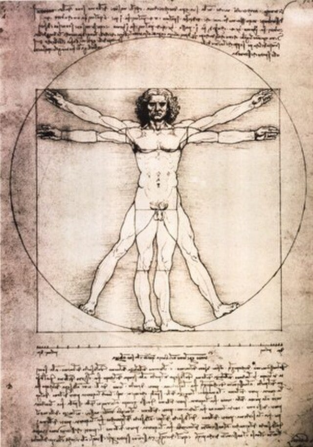

## Floating style

There's another hidden BS question about floating: not just can you float, but how should you position your body to float most stably? Do you go Jesus-style — arms outstretched in a T, legs together — or Vitruvian Man-style, limbs spread at angles?

{style="float:right; margin-left:1.5em; margin-bottom:1em; width:45%"}
The answer is almost certainly Vitruvian Man, and the reasoning is genuinely fun to unpack.

The core physics: Floating stability requires your center of buoyancy (CB) to stay vertically aligned with your center of gravity (CG). The problem is that your legs are denser than your torso (bone, muscle, less air), so they want to sink — rotating you face-down.

Why Vitruvian beats Jesus:

Legs spread (the key difference): Spreading your legs laterally distributes the dense lower-body mass over a wider footprint of water surface. Each leg gets more independent buoyant support. Jesus keeps legs together, concentrating that sinking tendency.

Arms at ~45° vs. 90°: The Jesus T-pose puts arms at maximum lever arm from the body's axis, which helps resist rolling — like outriggers. But arms at 45° (Vitruvian) are closer to the chest/lung buoyancy center, keeping the whole configuration more neutrally balanced front-to-back.

Rotational stability: The spread-limb Vitruvian position maximizes the second moment of area of the body's cross-section — more resistance to tipping in any direction. It's essentially increasing your rotational inertia.

The survival float connection: Swim instruction teaches the "starfish float" — which is Vitruvian Man. This isn't coincidence; it's empirically converged on the stable solution.

The fun wrinkle: Body composition matters enormously. A high-fat floater can get away with Jesus (or nearly anything). A lean, muscular swimmer may need more than Vitruvian — arching the back to push the chest up, tilting the head back to shift CG posteriorly. So the optimal pose is a function of your personal density distribution — a lovely individual differences angle.

Da Vinci wins over the Gospels, at least hydrodynamically.

