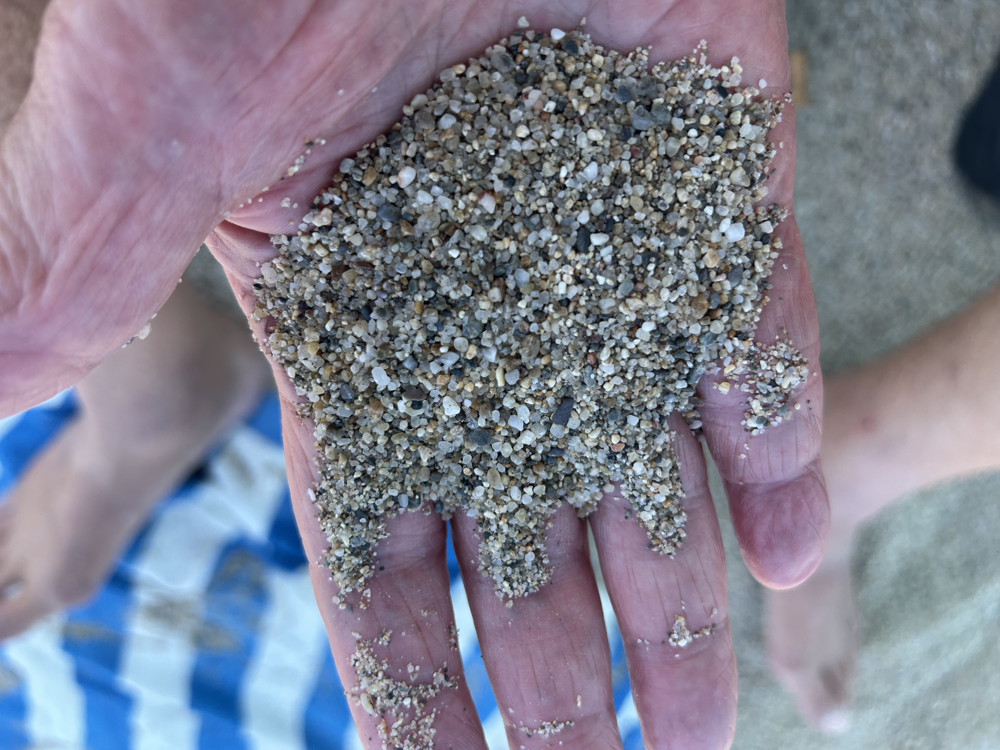

<!--
Combined draft for the beach-formation BS post: Leucate Plage intro, "How Beaches Form" (question 1), "The Beach as a Sieve" (question 2, grain size), and "Below the Waterline" (question 3, underwater continuation).
-->

## How Long to Make a Beach

{style="float:right; margin-left:1.5em; margin-bottom:1em; width:40%"}
I'm sitting on Leucate Plage, and without really thinking about it, I scoop up
a handful of sand. The grains are almost all the same size---but not quite. A
few coarser flecks here, some bits of shell, a paler fine dust there. And if I shuffle a few
metres back from the water's edge, the sand underfoot is noticeably finer than
what's sitting right at the swash line.

That's odd, if you think about it for even a second. Nothing planted these
grains here in size order. No one sieved this beach. And yet it sorts itself,
consistently, every day, with the same patient hand that's been at work for
millennia.

Three questions follow naturally from a handful of sand:

1. How does a beach actually form---what process, over what timescale, turns
   rock into this?
2. Why do grain sizes vary the way they do---both within a single scoop, and
   systematically across the beach profile?
3. Does the beach I'm sitting on continue in any meaningful way below the
   waterline, or does the "beach" stop where the water starts?

It turns out the answers to all three are the same answer, seen from
different angles: a beach is a sorting machine, running on physics that's
been well understood since the 1930s and 40s, and never resting.

## How Beaches Form

Before any sorting can happen, there has to be sand to sort. And the sand
in my hand is running on two clocks at once, ticking at wildly different
speeds.

The slow clock is geological. Somewhere upstream, rock is being weathered,
rivers are grinding it into grains, cliffs are being undercut by waves and
collapsing into the surf. This is the **sediment supply** --- an accounting
problem as much as a geological one, since coastlines that receive plenty
of it build wide, generous beaches, and coastlines that don't get left with
bare rock no matter how energetic the waves are. This clock runs on the
timescale of mountain-building and erosion: hundreds of thousands to
millions of years for the mineral grains themselves.

The fast clock is oceanographic, and it's the one that actually explains
why the beach under me looks the way it does today. Once sediment reaches
the coast, **longshore drift** takes over: waves arriving at even a slight
angle push sand up the beach diagonally on the swash, then gravity pulls it
straight back down the slope on the backwash, and the net effect, repeated
by every wave, is a slow conveyor belt of sand moving along the shore ---
feeding one stretch of coastline while quietly starving another.

But the beach itself, as a *system* --- this particular curve of sand at
this particular width --- is younger than either of those processes
suggests. Sea level rose quickly at the end of the last glaciation and then
stabilized close to its present level around 6,000--7,000 years ago, a
plateau geologists call the **Holocene highstand**. Most of the world's
modern beaches and barrier systems assembled into roughly their current
form only after that point. So the sand under my hand is simultaneously
hundreds of millions of years old, as mineral grains, and about six
thousand years old, as an *arrangement* --- which is a satisfying thing to
think about while doing absolutely nothing.

## The Beach as a Sieve

Stand on any beach and run sand through your fingers. On one beach it's a fine
powder; on another, coarse grains that click as they fall; on a third, actual
pebbles. This isn't random---a beach is a self-sorting machine, and the sorting
follows real statistical law.

The trick sedimentologists use is a change of scale. Instead of measuring grain
diameter $D$ in millimetres, they use the **phi scale** [@krumbein1938]:

$$\phi = -\log_2(D_{mm})$$

This is more than notational cleverness. Natural sediment size is
**log-normal** in millimetres---a consequence of repeated random fragmentation
(rocks breaking into pieces, those pieces breaking again), which Kolmogorov
showed mathematically produces a log-normal distribution, the multiplicative
cousin of the Central Limit Theorem [@kolmogorov1941]. Taking the log (the phi
transform) converts that log-normal mess back into an ordinary bell curve. In
phi-space, a beach's sand has a mean and a standard deviation just like any
other Gaussian quantity---and the standard deviation, $\sigma_\phi$, is
literally what Folk and Ward called the **sorting coefficient**
[@folk1957]: small $\sigma_\phi$ means "well sorted" (all grains similar
size), large $\sigma_\phi$ means "poorly sorted" (fine and coarse mixed
together, as you'd see below a rockslide or glacial outwash).

What actually does the sorting isn't grain size directly---it's **settling
velocity**. For fine grains, Stokes' law gives settling velocity proportional
to $D^2$; for coarser grains drag becomes turbulent and velocity scales as
$\sqrt{D}$. Grains that share a settling velocity get deposited together
regardless of size or density---which is the actual reason you sometimes see a
dark streak of heavy minerals (magnetite, garnet) sitting beside ordinary
quartz sand of a different size: same settling speed, different substance.

This is also the answer to the "finer sand further from the water" observation
that started this post: the swash zone is a high-energy, high-turbulence
environment that only lets the coarser, faster-settling grains stay put; finer
material gets picked up, carried, and redeposited higher on the beach where
the water's reach---and its energy---is weaker.

The figure below simulates four beach "sorting regimes"---sheltered fine
sand, an open medium-sand coast, a coarse/granule beach, and high-energy
shingle---using published sorting-coefficient ranges as inputs
[@folk1957]. No individual beach was measured; the simulation instantiates
a well-established distributional law with realistic parameters, the same
way a physicist simulates a pendulum with real $g$ rather than photographing
one. That's the honest way to make a "for-illustration" figure look real:
say plainly that it's simulated, and make sure what it's simulating is
actually true.

To visualize this, we simulate data from these distributions. Each beach
type gets a mean and standard deviation in phi-space, drawn from the
qualitative ranges Folk & Ward (1957) report for real beaches:

```{r grain-size-sim}
library(tidyverse)

set.seed(42)

beach_types <- tribble(
  ~beach, ~mean_phi, ~sd_phi, ~n,
  "Fine (sheltered bay)", 3.0, 0.30, 20000,
  "Medium (open coast)", 1.5, 0.45, 20000,
  "Coarse / granule", 0.0, 0.70, 20000,
  "Shingle (high-energy)", -3.0, 0.90, 20000
)

grain_data <- beach_types |>
  rowwise() |>
  reframe(
    beach = beach,
    phi = rnorm(n, mean_phi, sd_phi),
    mm = 2^(-phi)
  )

grain_data$beach <- factor(grain_data$beach, levels = beach_types$beach)

dens_data <- grain_data |>
  group_by(beach) |>
  reframe(as_tibble(density(phi)[c("x", "y")])) |>
  rename(phi = x, density = y)

peak_data <- dens_data |>
  group_by(beach) |>
  slice_max(density, n = 1) |>
  ungroup()

ggplot(dens_data, aes(phi, density, fill = beach, colour = beach)) +
  geom_area(alpha = 0.35, position = "identity") +
  geom_line(linewidth = 0.8) +
  geom_text(data = peak_data, aes(label = beach), vjust = -0.6,
            fontface = "bold", size = 3.5, show.legend = FALSE) +
  scale_x_reverse(name = expression(phi~scale~(phi == -log[2](D[mm])))) +
  scale_y_continuous(expand = expansion(mult = c(0, 0.15))) +
  labs(
    title = "Grain size distributions across beach types",
    subtitle = "Normal in φ-space ⇒ log-normal in mm (fragmentation theory, Kolmogorov 1941)",
    y = "Density"
  ) +
  theme_minimal(base_size = 13) +
  theme(legend.position = "none")
```

Each curve is normal in phi-space by construction, but because
$D = 2^{-\phi}$, the same data plotted in millimetres would show the
familiar log-normal shape: a sharp peak of typical grains trailing off into
a long tail of coarse outliers. The narrow, tall curve on the right is the
sheltered fine-sand beach; the wide, flat curve on the left is the shingle
beach, where "poorly sorted" means exactly what it looks like --- fine and
coarse material dumped together with no consistent settling velocity to
separate them.

The same self-sorting logic operates on the whole beach profile, not just
individual grains. Dean's equilibrium profile,

$$h(x) = A\, x^{2/3}$$

says that a beach's cross-shore shape depends on grain size through the
scale parameter $A$---coarser sediment supports a steeper equilibrium slope,
because coarse grains need more wave energy (steeper water) to stay in
motion at all [@dean1991]. Fine sand spreads itself thin over a gentle
slope; shingle piles up steep. It's the same sorting principle, just
applied in two dimensions instead of one.

```{r dean-profile}
dean_profile <- function(x, A) A * x^(2/3)

profile_data <- expand_grid(
  x = seq(0, 200, length.out = 400),
  A = c(0.10, 0.15, 0.21)
) |>
  mutate(
    depth = -dean_profile(x, A),
    grain = factor(A, labels = c("Fine (A=0.10)",
                                  "Medium (A=0.15)",
                                  "Coarse (A=0.21)"))
  )

end_data <- profile_data |>
  group_by(grain) |>
  filter(x == max(x)) |>
  ungroup()

ggplot(profile_data, aes(x, depth, colour = grain)) +
  geom_line(linewidth = 1) +
  geom_text(data = end_data, aes(label = grain), hjust = 1, vjust = 0,
            nudge_y = 1.0, fontface = "bold", size = 3.5, show.legend = FALSE) +
  scale_x_continuous(expand = expansion(mult = c(0.01, 0.06))) +
  labs(
    title = "Dean equilibrium beach profile",
    subtitle = expression(h(x) == A ~ x^{2/3}),
    x = "Distance offshore (m)", y = "Depth below MSL (m)"
  ) +
  theme_minimal(base_size = 13) +
  theme(legend.position = "none")
```

Each line traces the seabed depth predicted by Dean's formula for a fixed
value of $A$. The three curves aren't fit to any particular beach --- they
show how the same equation reshapes itself as one parameter, grain size,
changes: larger $A$ (coarser sediment) drops away steeply close to shore,
while smaller $A$ (fine sand) spreads the same depth change over a much
longer run of shallow water.

## Below the Waterline

So the beach sorts itself by grain size, and it's younger than it looks. But
does "the beach" stop where the water starts, or does it keep going?

It keeps going --- just under a different name. Below the waterline, the
same sloping accumulation of sediment continues as the **shoreface**,
conventionally split into two bands. The **upper shoreface** is shallow
(roughly 3--10 metres deep, extending 100 to 1,000 metres offshore) and is
where almost all the actual sediment transport happens: waves break here,
stir up sand, and keep the profile in a rough dynamic equilibrium. The
**lower shoreface** is deeper and much quieter --- ordinary waves don't
reach the bottom, only storms disturb it, and it can take anywhere from
decades to millennia to adjust to a change.

There's a real answer to "how far does this go," too, and it comes with a
formula, the way these things do in Beach Science. The **closure depth**
is the point offshore beyond which wave action no longer moves the bottom
sediment at all --- the practical edge of "the beach," underwater.
Hallermeier's formula estimates it from the waves themselves [@hallermeier1981]:

$$h_{in} = 2.28\,H_s - 68.5\left(\frac{H_s^2}{g\,T_s^2}\right)$$

where $H_s$ is the significant wave height and $T_s$ its period --- or, in
the version you can do in your head on a towel, $h_{in} \approx 8.9\,\bar{H}_s$,
about nine times the average wave height. For most coasts this puts the
inner closure depth around 5--10 metres, with an outer closure depth ---
past which even storms are irrelevant --- somewhere around 15--40 metres.

It's the same underlying idea as Dean's equilibrium profile above, just
extended past the point where the dry-sand version of "beach" runs out: a
shape made by wave energy, that keeps going until the energy runs out too.

### References

::: {#refs}
:::
