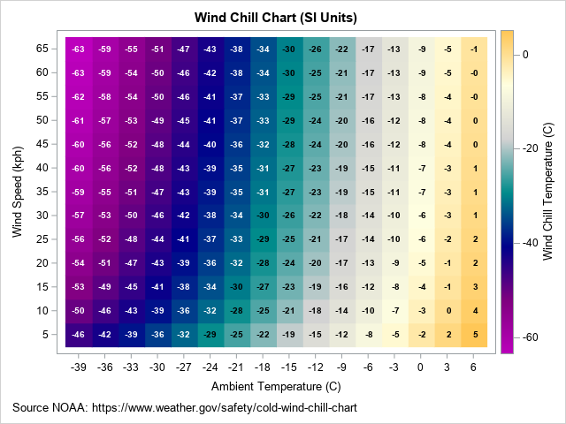
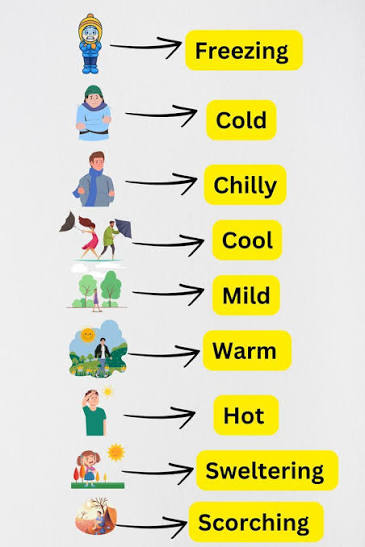

<!-- Image from: "C:\R\Projects\friendly.github.io\blog\drafts\BeachScience\images\thermometer-readouts.webp" -->

Standing at the water's edge this morning, I described the Mediterranean air to my companion as "brisk". She called it "refreshing". A man walking past, perhaps from somewhere much colder, called it "mild". We were all describing the same air at the same moment. 

We all go for a plunge
in the clear blue waters. Comparing our impressions, I call it "chilly"; my companion says, 
"cool, and refreshing"; the stranger calls it "temperate". Again: same water but different
words to describe what we feel.


This is not a failure of communication, or something you can just dismiss as "individual differences."
It is a BS research question.


## The Meterologist's View

A meteorologist, coming from physical science, explains [What is ‘feels-like’ temperature?](https://www.popsci.com/environment/what-is-feels-like-temperature/) 
in terms of [wind-chill](https://en.wikipedia.org/wiki/Wind_chill). This idea
even gets a measure, the **wind-chill factor** (or "feels like" temperature). It is
defined in words as: 

> the apparent temperature felt on exposed skin caused by the combination of air temperature and wind speed. Wind strips away your body's natural insulating layer of warm air, making the temperature feel significantly colder than the thermometer reads.

{style="float:right; margin-left:1.5em; margin-bottom:1em; width:45%"}

But that's quite a physical mouthful. There are formulas for this, but
you can understand the physics more easily from a [**heatmap**](https://en.wikipedia.org/wiki/Heat_map) visualization that simply uses background color for the "feels-like" value. Rick Wiklin, a long time friend, explains 
how to create [The wind chill chart](https://blogs.sas.com/content/iml/2021/02/24/wind-chill-chart.html) using SAS,
giving the figure at the right.

---

## What About the Words?

But even if you understand the physics, how can you understand the **words** you use to describe
your feeling of warmth when you are sitting on the beach, or decide to go for a swim?
Perception goes beyond the physics. And there is also something interesting about the way we
use discrete, qualitative words to describe what is a quantitative phenomenon.


## The Probability Analogy


In the 1960s, a CIA analyst named [Sherman Kent](https://en.wikipedia.org/wiki/Sherman_Kent) noticed that intelligence reports were full of words like "probable", "unlikely", "almost certain"--- but not everyone agreed on what they meant. He asked a group of NATO officers to assign numerical probabilities to phrases like "serious possibility" and "little chance." The results were alarming. "Probable" mapped to anywhere from 55% to 90% depending on who you asked. Words that felt precise were carrying enormous hidden uncertainty. Not very good when you're
thinking about which foreign interests to support or the likelihood of effecting regime change,


The same problem almost certainly applies to **temperature language**. When your weather app says "warm", when a friend describes the sea as "chilly", when a wine menu mentions serving at "room temperature"---these words are doing quantitative work while pretending to be qualitative. They certainly are _ordered categories_, but nobody has agreed on the numbers.


Beach Science would like to fix this.

Let's look at the methods used to understand words for probability as a model, first proposed
in a [Reddit post by zonination](https://github.com/zonination/perceptions/blob/master/README.md), and using a [ridgeline plot](https://wilkelab.org/ggridges/) to show the distribution of the numerical values that a sample of respondents assigned to a wide range of words used to describe probability.


```{r}
#| label: setupg
#| echo: false
library(tidyverse)
library(ggridges)

probly <- read_csv("https://raw.githubusercontent.com/zonination/perceptions/master/probly.csv")

prob_long <- probly |>
  pivot_longer(everything(), names_to = "term", values_to = "probability") |>
  filter(!is.na(probability)) |>
  group_by(term) |>
  mutate(med = median(probability)) |>
  ungroup() |>
  mutate(term = fct_reorder(term, med))

term_summary <- prob_long |>
  distinct(term, med)
```

```{r}
#| label: fig-probwords
#| fig-cap: "Perceived probability of estimative words (n ≈ 46). White dot = median. Data: [Zonination](https://github.com/zonination/perceptions)."
#| fig-width: 9
#| fig-height: 9
ggplot(prob_long, aes(x = probability, y = term, fill = med)) +
  geom_density_ridges(scale = 1.8, rel_min_height = 0.01,
                      colour = "grey30", linewidth = 0.4, alpha = 0.85) +
  geom_point(data = term_summary,
             aes(x = med, y = term),
             colour = "white", size = 1.8, inherit.aes = FALSE) +
  scale_fill_gradient2(low = "#2166ac", mid = "#f7f7f7", high = "#d6604d",
                       midpoint = 50, name = "Median\n(%)") +
  scale_x_continuous(breaks = seq(0, 100, 10),
                     labels = function(x) paste0(x, "%"),
                     limits = c(0, 100)) +
  labs(title = 'How likely is "likely"?',
       subtitle = "Perceived probability of estimative words (n ≈ 46)\nWhite dot = median",
       x = "Assigned probability (%)", y = NULL,
       caption = "Data: Zonination · github.com/zonination/perceptions") +
  theme_ridges(grid = TRUE, center_axis_labels = TRUE) +
  theme(plot.title = element_text(face = "bold", size = 16),
        legend.position = "none")
```


---


## A Lexicon of Warmth


{style="float:right; margin-left:1.5em; margin-bottom:1em; width:45%"}
Here, roughly ordered from coldest to hottest, are a modest selection of terms worth studying:


* The cold end: Freezing. Frigid. Icy. Bitter. Raw. Chilly. Cool. Fresh. Crisp.


* The middle: Mild. Comfortable. Pleasant. Temperate. Neutral. Lukewarm. Tepid.


* The warm end: Warm. Balmy. Sultry. Toasty. Hot. Sweltering. Scorching. Blistering. Broiling.


### The Slippery Ones:

- "Brisk" — means cold, but often said cheerfully, to imply you don't mind.

- "Refreshing" — means cold, said approvingly, usually while entering water you were dreading.

- "Perfect beach weather" — means something different to everyone who says it.

- "Room temperature" — nominally 20°C, actually whatever the room happens to be.

- "A bit nippy" — British for genuinely cold, deployed as understatement.


The last category is the most interesting. These terms carry emotional valence as well as thermal content — they tell you not just how warm something is, but how the speaker feels about it. Separating those two things is itself a research problem.


---


## What to Measure?


A proper BS study would present subjects with this list of terms — perhaps 25–30 in total — and ask them to assign a temperature in degrees Celsius to each one. Not a range. A number. The discomfort of that precision is the point.


From a reasonable sample you'd get, for each term:

- A mean "intended temperature"
- A standard deviation (how much people disagree)
- Possibly a bimodal distribution for the slippery ones — refreshing might split between people who love cold water and people who merely tolerate it


You'd also want to ask about context. "Warm" for bathwater, air temperature, and sea temperature are probably calibrated quite differently. "Lukewarm" for coffee is not the same as "lukewarm" for political support — though it would be amusing to find out if they're numerically similar.


---


## Individual Differences


The Kent study found systematic differences by nationality and professional background. You'd expect the same here, and more:

- Geographic origin — someone from Helsinki and someone from Lagos will not agree on mild
- Age — thermoregulation changes with age; older people tend to run cooler
- Sex — well documented differences in thermal comfort, still not fully explained
- Recent acclimatisation — what felt cold on day one of a beach holiday feels brisk by day five


This suggests the study needs demographic covariates, and that the interesting finding might not be the mean temperatures but the variance — which terms are universally agreed upon, and which are doing completely different work for different people.


My prediction: freezing and scorching will have the tightest agreement. Mild, comfortable, and fresh will be all over the place.


---


## How to Study It


An online survey would work fine — present the terms in randomised order, ask for a numeric temperature response, collect demographics. A hundred respondents would give you something interesting; a thousand would give you something publishable.


The analysis is straightforward: descriptive statistics for each term, then a plot showing the distribution of responses — a ridgeline plot or violin plot would show both the central tendency and the spread beautifully. Terms ordered by median temperature on the y-axis; spread showing disagreement. You'd see immediately which words are doing precise work and which are vessels into which people pour their own thermal experience.


A follow-up study worth doing: present the same terms with context (the sea was refreshing, the coffee was lukewarm, a mild day for January) and see how much context shifts the numbers. My guess: substantially.


---


*Postscript:* I asked my companion what temperature she'd assign to "warm." She said 24°C. I said 19°C. We have been on this beach for four days. We are, apparently, still not calibrated to the same scale.
