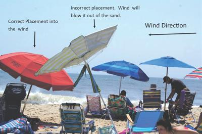

I had just settled in at Leucate Plage. Towel down, umbrella up, sunscreen applied with the methodical thoroughness of someone who has learned lessons the hard way. Kindle in hand, opening chapter.

Woosh.

A gust of Mediterranean wind, entirely indifferent to my plans, plucked the umbrella cleanly from the sand and sent it cartwheeling down the beach toward the water.

Isn't this a great moment for Beach Science?

---

## 🌬️ The Physics of the Problem

{style="float:right; margin-left:1.5em; margin-bottom:1em; width:45%"}

Hey, I took two years of physics at Stuyvesant High School and two more at RPI --- as a math major, granted, but still. I should remember something. Let me think.

A beach umbrella in wind is, at its core, a sail on a stick jammed into sand. The forces trying to topple or launch it are well understood:

- **Drag** --- the wind pushes horizontally against the canopy
- **Lift** --- the curved canopy generates upward aerodynamic force, exactly like a wing (or an inverted one, depending on orientation)
- **Torque** --- these forces combine to rotate the pole around its base, levering it out of the sand

Wind direction _relative_ to canopy orientation matters too. A head-on gust hits the full projected area of the canopy; a crosswind creates an asymmetric pressure distribution that generates torque around the vertical axis, twisting the pole in the sand rather than levering it out. The failure modes are different — extraction vs. rotation — and the fixes are slightly different too. For crosswinds, a deeper pole helps more than tilt angle.

The only things resisting all of this are the friction of sand gripping the pole and the weight of the umbrella itself. In dry, loose surface sand --- exactly what you find at the top of a beach --- that grip is approximately that of a bowl of sugar. Hence: woosh.

---

## 🛠️ What the Physics Tells You to Do

{style="float:right; margin-left:1.5em; margin-bottom:1em; width:45%"}

**Tilt into the wind.** Most people jam the pole in vertically. This is wrong. Tilting the umbrella 20--30° toward the wind reduces the effective surface area presented to it and, crucially, redirects aerodynamic lift downward rather than upward. A small adjustment; a large effect.

**Twist as you push, and wet the sand first.** A rotating pole compacts the sand as it descends, creating a tighter grip. Wet sand compacts and interlocks far better than dry --- pour a little water from your bottle down the hole before inserting. This is simple soil mechanics and it works.

**Go deeper than you think necessary.** The torque trying to extract your pole scales with wind speed squared. What holds at a gentle breeze fails catastrophically at a gust. An extra 10cm of depth is cheap insurance.

**Deploy the sandbag, or improvise one.** Sandbags work by adding downward force at the base, directly countering the rotational torque. No sandbag? A wet towel draped over the base, or your cool box sitting against the pole, achieves a similar effect. Inelegant. Effective.

**Choose a vented umbrella.** Many beach umbrellas now have a small vent or mesh panel at the top. This is not decorative --- it bleeds off pressure that would otherwise build under the canopy. A vented umbrella can withstand substantially higher winds than an identical unvented one. This is [Bernoulli](https://en.wikipedia.org/wiki/Bernoulli%27s_principle), quietly doing his job.

| Anchor type | Best use | Performance |
|---|---|---|
| Screw / auger sand anchor | Most beach setups | Strong and reliable |
| Deep hole with compacted sand | No anchor available | Moderate |
| Sandbags / weight pockets | Extra wind stability | Strong (secondary use) |
| Drill with sand auger | Loose sand | Very strong |

: Common anchor options, from [Aosom](https://www.aosom.ca/blog-how-to-hold-down-your-beach-umbrella.html) {.striped}

---

## ☀️ The Sun vs. Wind Tradeoff

Here is an under-appreciated complication: the sun and the wind are usually not coming from the same direction. You want your umbrella angled toward the wind for stability, but angled away from the sun for shade. These objectives are frequently in conflict, and resolving them requires the kind of on-the-spot trigonometry that is surprisingly satisfying to perform.

The general solution: prioritize wind angle for stability (a flying umbrella provides no shade at all), then move your towel to compensate for the shadow direction. You are the moveable part; the umbrella is not.

The geometry is actually tractable. The sun's azimuth at any hour is knowable---your phone's compass and a weather app will give you both wind direction and solar bearing. The angle between them is the problem you're solving. If they're within about 30° of each other, you're lucky: one tilt serves both masters. If they're 90° or more apart, you're choosing. Choose wind. A shadow you can rotate around; a spear in flight you cannot.

---

## ⚠️ Safety note

An airborne beach umbrella is not merely an inconvenience. The pole is a spear. There are documented cases of serious injuries from runaway umbrellas on crowded beaches --- puncture wounds, broken bones. This is not a fringe risk; it scales directly with how busy the beach is and how cavalier people are with insertion depth.

The physics of beach umbrella safety is, in a small but real way, a public health issue.

---

## 🔬 How Would You Study This?

A proper Beach Science investigation of umbrella stability might measure:

- **Wind speed** at the moment of failure (small anemometer, or a weather station app)
- Insertion **depth** and tilt **angle** for each umbrella
- Sand **moisture** at depth (a soil moisture probe, or a wetness rating scale)
- Canopy **diameter** and **vent** presence as umbrella characteristics
- **Time to failure** --- or, for umbrellas that don't fail, whether they survived the observation period.

That last variable is not entirely facetious. Umbrellas fail most dramatically the moment attention lapses: a trip to the water, an exciting chapter of a novel, a conversation. The watching variable is a crude proxy for the kind of real-world confounding that makes field studies interesting and laboratory results insufficient. Nature does not wait for you to finish your measurements.

With a sample of beach umbrellas observed over a breezy afternoon, a [survival analysis](https://en.wikipedia.org/wiki/Survival_analysis) (time-to-event model) would be the natural framework --- the same statistical machinery used to model equipment failure, clinical outcomes, or, appropriately enough, the lifespan of sandcastles.

The predictor you'd expect to matter most: insertion depth. The interaction you'd expect to be interesting: depth × wind speed. The covariate everyone would forget to measure: whether the owner was watching.

---

## 🔗 Further Reading

**The physics**

- Chemniverse, ["The Physics of Umbrellas: How They Withstand Wind and Rain"](https://chemniverse.com/the-physics-of-umbrellas-how-they-withstand-wind-and-rain/) --- lift, drag, and canopy geometry explained accessibly
- AMMSUN, ["How Windy is Too Windy for a Beach Umbrella?"](https://www.ammsun.com/blogs/news/how-windy-is-too-windy-for-a-beach-umbrella) --- practical wind thresholds and what they mean for stability
- UV-Blocker, ["Wind-Proofing Your Shade: Why Most Beach Umbrellas Fail"](https://uv-blocker.com/blogs/sun-protection/wind-proofing-your-shade-why-most-beach-umbrellas-fail-and-how-to-fix-it) --- design failures and aerodynamic fixes

**Safety and injuries**

- Levenson et al. (2021), ["Beach and patio umbrella injuries treated at U.S. emergency departments"](https://pubmed.ncbi.nlm.nih.gov/34848009/) --- the epidemiology; 31,000 injuries in a decade
- [BeachUmbrellaSafety.org](https://www.beachumbrellasafety.org/) --- dedicated safety campaign, statistics, and the ASTM F3681 standard
- NJ Lawyers, ["NJ Officials Call Attention to Beach Umbrella Injuries"](https://www.njlawyers.com/blog/nj-officials-call-attention-to-beach-umbrella-in) --- real incident reports that read exactly like the physics predicts

**Anchoring in practice**

- Aosom, ["How to Hold Down Your Beach Umbrella?"](https://www.aosom.ca/blog-how-to-hold-down-your-beach-umbrella.html) --- everything you need to know to keep your umbrella from taking flight: placement, anchoring methods, managing the wind.

- *Today*, ["The best way to secure your beach umbrella so it won't go flying"](https://www.today.com/home/best-way-secure-your-beach-umbrella-so-it-won-t-t134327) --- practical consumer guide; tilt, depth, and wet-sand tips
- *Reviewed*, ["How to secure a beach umbrella on a windy day"](https://www.reviewed.com/home-outdoors/features/how-to-secure-a-beach-umbrella) --- step-by-step with product recommendations

---

Next time the wind picks up, you now have a framework. Tilt into it, go deep, weight the base, and buy a vented umbrella. Or, failing all of that, at least make sure nobody is downwind.

## 📋 Posts in This Series

- [Beach Science: A New Field is Born](../../../posts/2026-06-beach-science/)
- [Warm-Up Exercises for the Beach Scientist](../../../posts/2026-06-beach-science-warmup/)
- [How Warm Is "Warm"?](../../../posts/2026-06-beach-science-howwarm/)
- [Are You a Beach Person or a Pool Person?](../../../posts/2026-06-beach-science-beachpeople/)
- [Beach Patterns as a Physics Laboratory](../../../posts/2026-06-beach-science-patterns/)
- The Aerodynamics of Not Losing Your Umbrella *(this post — coming soon)*
