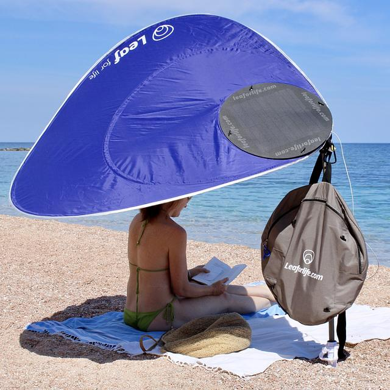

## The French Connection: A Leaf That Won't Flip

Beach umbrellas haven't fundamentally changed in 70 years---thin ribs on a central pole, 
holding up a dome that inevitably turns inside out the moment the wind picks up. 
A French startup founded in 2015 in the south of France, on the Mediterranean coast 
where afternoon sea breezes are a daily fact of life, decided to solve this properly rather 
than just buying a sturdier pole. Their answer, [Leaf for Life](), does away with the dome entirely: 
a flat disk canopy with a stiff wire rim, mounted at a single off-center 
point on a telescoping pole---inspired, they say, by the shape of a Monstera leaf. 
It looks almost too simple to be a design innovation. 
But the reason it can't blow inside out is genuinely interesting physics, and it 
has nothing to do with strength---it's about removing an instability, not resisting a force.

A conventional dome umbrella is a **bistable** structure. Its ribs hold it in one elastic equilibrium 
under normal conditions, but wind loading pushes the shell toward a second, energetically 
favorable equilibrium---inside-out---and once the pressure crosses a threshold, 
the structure "snaps through" to that second state almost instantaneously. 
It's the same phenomenon as a popped-in tin lid or a jar lid that suddenly inverts with a click. 
The central pole makes this worse: it clamps the whole shell rigidly along one axis, forcing every gust to be resisted rather than deflected.

The flat-disk, off-center, single-point mount changes the mechanics on two levels. First, a flat disk with a tensioned wire rim has only one stable shape---there's no second equilibrium to snap into, so the catastrophic failure mode simply isn't available. Second, because the canopy is attached at one point rather than clamped, wind torque can rotate the whole disk around that mount like a weathervane, turning face-on wind loading into a gentle yaw instead of a structural fight. The asymmetric leaf shape isn't just aesthetic---it biases that rotation toward a consistent wind-aligned resting position, the same way a weathercock's tail fin does.

So the umbrella that can't blow inside out isn't the stronger umbrella. It's the one that gave up having anything to blow inside out into.

