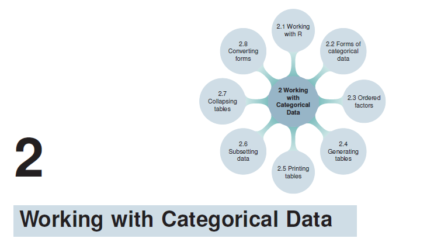
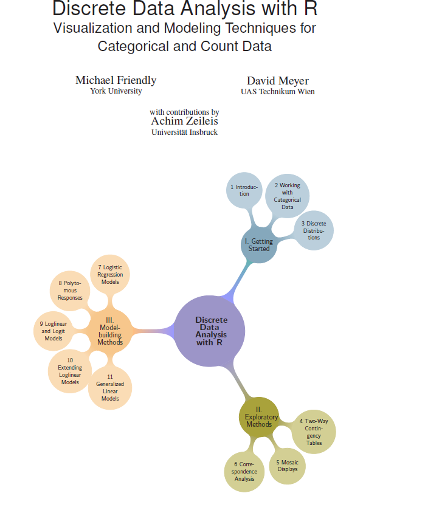

This is the second post in the [Making of Vis-MLM](../2026-04-26-making-vis-mlm/index.qmd) series.
The [first post](../2026-04-26-making-vis-mlm/index.qmd) described the `.Rnw` vs. Quarto pipelines and the
topics I'll be covering. Here I go deeper on what that trade-off actually felt like in practice —
where the abstraction over LaTeX helped, where it hurt, and what it took to recover control.

When I was writing [*Discrete Data Analysis with R*](https://www.taylorfrancis.com/books/mono/10.1201/b19022/discrete-data-analysis-michael-friendly-david-meyer)
in `.Rnw`, I had complete control over the entire PDF pipeline. I could design custom visual chapter headers
and Part title pages with coordinated accent colors:

::: {layout-ncol=2}



:::

Along with a comprehensive dual index (Subject + Author), it's the book I'm most proud of.

Quarto traded that control for something I genuinely wanted: a free online HTML version alongside the
print book, from a single source. The trade-off turned out to be steeper than advertised.
This post documents where the abstraction layer broke things that were trivial in `.Rnw`.

## The fundamental tension

In `.Rnw`, you **controlled the LaTeX**. The final `book.tex` contained exactly the `\cite{}`,
`\index{}`, and `\usepackage{}` calls you wrote. You could open it in
[TeXStudio](https://www.texstudio.org/), see exactly where problems were, and re-run any
individual step in the pipeline.

In Quarto, **pandoc owns the `.tex` file**. It reads your Markdown (with knitr-executed R
output spliced in), resolves citations itself via `citeproc`, and emits LaTeX that doesn't look
like anything you wrote. External tools that plug into the traditional LaTeX pipeline — BibTeX,
`authorindex`, `makeindex` — often break because the `.tex` and `.aux` files don't have the
structure those tools expect.

The `_quarto.yml` file is now the center of gravity: project type, book metadata, chapter list,
bibliography sources, output formats. That works beautifully for simple projects. When something
breaks, knowing where to look is the first puzzle.

What this also means is that there is much more to learn and understand if you want to take
advantages of some of the lovely features Quarto offers:

- **Extensions**: Analogous to LaTeX packages, the Quarto community provides a wide range of
  extensions for things like custom callouts, diagrams, and shortcodes.
- **Multiple languages**: Quarto supports R, Python, `mermaid` diagrams, and more in the same
  document.
- **Conditional compilation**: Different content for HTML vs. PDF from a single source —
  animated graphics in HTML, static replacements in PDF.
- **Tabsets**: Easy reader-selectable views in HTML (R vs. Python code, data by group, ...) with
  no natural equivalent in print.

But you can quickly get into trouble if you want features (like a serious index, fancy page
design, external LaTeX tools) that are simple in LaTeX but fraught in Quarto. As I write this, a
[Quarto 2.0](https://quarto.org/docs/blog/posts/2026-04-06-whats-next-quarto-2/) is in the works.
The Quarto team acknowledges: *"Quarto 1 is built by integrating a number of tools that work very
well in isolation, but aren't designed to be performant when used together."* The issues run deeper.

## Whitespace shouldn't matter

When writing, the focus should be on ideas — markup exists to express them in style and formatting.
Markdown violates the spirit of WYSIWG in a few quiet ways:

- **Hard line breaks**: ending a line with two or more trailing spaces before a newline creates an
  HTML `<br>` within the paragraph. A common invisible typo.
- **Blank lines matter**: code chunks, equations, and list items placed immediately after prose
  (without a blank line) often render unexpectedly. The rule is consistent, but inconsistent with
  how authors think.

## The `<div>` vs `:::` design

Nearly everything in Quarto that is not straight-up text or a code chunk — callout blocks,
conditional content, custom layouts — uses the fenced div syntax:

````markdown
::: {.callout-note}
Text here.
:::
````

This maps to the HTML `<div>...</div>` construct: a generic container used for grouping, styling,
and JavaScript targeting. `<div>` nesting is how the web creates hierarchical structure, with
properties inherited from parents.

The problem is **visual legibility in source**. HTML developers indent nested `<div>` elements
to make hierarchy visible. Quarto's `:::` syntax provides no standard indentation convention:
deeply nested conditional blocks (a callout inside a format-conditional block inside a tabset)
become a wall of colons with no visual hierarchy. This is minor but adds up across a 15-chapter
book.

## Problems in practice

The sections below summarize the specific issues I hit. Some have their own detailed posts in the
series; others I may write up separately.

### Dropbox won't work

In `.Rnw`, the DDAR project lived in `C:/Dropbox/` without issues, synced across machines. Quarto
writes many temporary files during compilation (`.aux`, `.log`, `.quarto/`, figure caches) and is
very sensitive to files being locked or modified by external processes. Dropbox's continuous sync
interferes with file-locking errors like:

```
The process cannot access the file because it is being used by another process.
```

**Fix:** Move the project to a local directory outside Dropbox. Use `git` exclusively for sync and
backup. (Dropbox now supports a `~/Dropbox/.dropboxignore` rules file, similar to `.gitignore`,
as an alternative.)

### The `authorindex` disaster

In `.Rnw`, generating an Author Index alongside the Subject Index was straightforward: `\usepackage{authorindex}`,
run the `authorindex` Perl script after BibTeX, add `\printauthorindex`. It Just Worked.

In Quarto, five things broke simultaneously:

1. **No `\cite{}` in the generated `.tex`** — pandoc `citeproc` resolves all citations before
   LaTeX runs, replacing `[@key]` with `\citeproc{ref-key}{Formatted Author, Year}`. The
   `authorindex` package intercepts `\cite`; since there are no `\cite` calls, it writes zero
   entries.
2. **No BibTeX step** — `citeproc` reads `.bib` files itself and emits a `\begin{thebibliography}`
   block directly. LaTeX never calls BibTeX, so `\bibdata{}` is never written to `.aux`. The
   Perl script dies: *"You must specify at least one BibTeX database."*
3. **Citation keys renamed** — pandoc prefixes every key with `ref-`, so `Friendly2013` becomes
   `ref-Friendly2013`. BibTeX lookups fail silently.
4. **`authorindex.sty` doesn't auto-patch `\cite`** — it provides `\aicite` as opt-in. In `.Rnw`
   you could use `\aicite` directly; in Quarto the `.tex` is generated and you can't.
5. **Windows CRLF line endings** — the `authorindex` Perl script was written for Unix; its regexes
   anchor on `$` but `\r` sits before `\n` on Windows, causing every pattern match to silently
   fail. No errors, no output, no index.
6. **`@Preamble` in `.bib` files silently ignored** — `citeproc` reads `.bib` but never passes
   `@Preamble` content to LaTeX, breaking author names that rely on custom commands defined there.

**Workaround:** Patch `\@citex` in `preamble.tex` to also call `\@aicitey`; write `\bibdata`
manually to the `.aux` file; fix CRLF in the Perl script; strip `ref-` prefix from keys; move
`@Preamble` command definitions into `preamble.tex`. See the dedicated post in this series for
details.

### Indexing R function names with underscores

In LaTeX, `_` is the subscript character in math mode. In `.Rnw`, a macro like
`\ixfunc{stat\_ellipse}` let you write the escaped name once and everything was consistent.

In Quarto, index entries are emitted as raw LaTeX strings from inline R expressions. Markdown,
pandoc, and LaTeX each have different opinions about underscores — the rules for escaping differ
between code spans, prose, and inline LaTeX, and the two-argument `\ixfunc{sort-key}{display-text}`
pattern is needed to thread the needle. See [Creating Book Indexes in Quarto](../quarto-indexes/index.qmd) for the full solution.

### Links become dead text in print

In Markdown, `[text](url)` renders as a hyperlink in HTML. In a printed book it renders as just
`text` — the URL disappears. In `.Rnw` you could redefine `\href` globally:

```latex
\renewcommand{\href}[2]{#2\footnote{\url{#1}}}
```

In Quarto, adding this to `preamble.tex` applies globally including to internal cross-references
that shouldn't become footnotes. Conditional `::: {.content-visible when-format="pdf"}` blocks can
help, but require rewriting every link in the source.

**Status:** Open. Needs a systematic pass through all chapters.

### Formatting R package, dataset, and function names

In `.Rnw`, a single macro did everything:

```latex
\def\pkg#1{\textsf{#1}\ixp{#1}\citex{#1}\xspace}
```

One `\pkg{ggplot2}` call typeset the name, added two index entries, and cited the package on first
use. No duplication, no inconsistency, same behavior everywhere.

In Quarto, you need an R function that detects output format and generates different output for
HTML vs. PDF. Getting it to also emit `\index{}` entries without breaking HTML is non-trivial.
The current `pkg()` in `R/common.R` handles formatting and optional citation; indexing is handled
separately via `\ixp{}` macros. See [Creating Book Indexes in Quarto](../quarto-indexes/index.qmd).

### Build workflow fragility

In `.Rnw`, "compile" was an explicit sequence: knitr → LaTeX → BibTeX → LaTeX → makeindex → LaTeX.
Each step was transparent; failure identified itself.

In Quarto, `Build → Render Book` is one monolithic operation. When it fails, the error may come
from R, pandoc, LaTeX, or Quarto itself, and messages are sometimes swallowed or misattributed.

Two additional Quarto-specific quirks:

- Building only HTML **wipes `docs/`** even if you changed only a PDF-specific file, because
  Quarto re-renders all output.
- `output-file: Vis-MLM` in `_quarto.yml` sounds like it names the PDF. It doesn't — it names the
  LaTeX intermediate (`Vis-MLM.tex`). The final PDF is named after the entry-point file
  (`index.qmd`) and lands in the project root as `index.pdf`. The `.aux` file is therefore
  `index.aux` — which breaks external tools that expect it to match the output filename.

### No incremental build

In `.Rnw`, a `Makefile` could rebuild only what had changed. You could run `make chapter3` and
only that chapter would be re-knitted and re-typeset. The PDF viewer could stay open; pdflatex
overwrites in place and the viewer reloads.

In Quarto, there is no Makefile equivalent. Quarto has chunk-level caching (`cache: true`) but a
change to `_quarto.yml` or `preamble.tex` can invalidate the entire cache and force a full rebuild
of all 15 chapters.

Worse: Quarto deletes and recreates `index.pdf` on every build rather than overwriting it. The
**PDF must be closed** in Acrobat before building, or the build fails:

```
ERROR: The process cannot access the file because it is being used by another process.
(os error 32): remove 'C:\R\Projects\Vis-MLM-book\index.pdf'
```

### The mysterious freeze cache

Quarto's execution cache (`.quarto/_freeze/`) stores the output of knitr chunks so unchanged
chapters can be skipped on subsequent builds. When an R helper function changes but the surrounding
`.qmd` source does not, Quarto sees no reason to invalidate the cache — old output silently
persists until it causes a LaTeX error.

In one incident, updating `dataset()` to use a cleaner `\ixd{}` macro left a stale cache entry
that still had trailing `%` comment characters. The `%` commented out a following `\footnote{}`,
the footnote brace was never opened, and LaTeX failed with:

```
! Extra }, or forgotten \endgroup.
```

The error pointed at `\citeproc{ref-Blishen-etal-1987}{1987}` — the last token before the orphaned
`}` — which led to a long but incorrect investigation of the `citeproc` machinery. The real culprit
was invisible: the stale freeze cache.

**Fix:** Delete the stale file:

```bash
rm .quarto/_freeze/<chapter>/execute-results/tex.json
```

**Lesson:** Treat the freeze cache as a build artifact that can become stale when R helper
functions change. Check it before investigating the LaTeX machinery when errors appear right
after changing `R/common.R`.

### Code chunks aren't invisible to all readers

The freeze cache is one symptom of a deeper structural issue. Knuth designed TeX around the
metaphor of a *mouth* that consumes a single, linear stream of tokens — category codes,
grouping, macro expansion all governed by the same tokenizer and the same rules. A `%`
comment is a `%` comment everywhere. Code is code everywhere.

A Quarto document passes through at least three independent readers, each with its own model
of what the document contains:

1. **Quarto's book builder** — pre-scans raw `.qmd` source files to extract chapter titles
   and build the sidebar/TOC, before knitr runs.
2. **knitr** — executes R code chunks according to chunk options (`include`, `echo`, `eval`).
3. **pandoc** — converts the post-knitr Markdown to HTML or LaTeX.

What is invisible to one reader may be fully visible to another.

I hit this directly when I added a comment to the hidden R setup chunk at the top of
`index.qmd`:

````markdown
```{r include=FALSE}
source("R/common.R")
clean_pkgs()
# Make \usepackage{smartdiagram} available for the {tikz} diagram below.
knitr::opts_chunk$set(...)
```
````

knitr correctly suppresses the entire chunk (`include=FALSE`). pandoc never sees it. But
Quarto's book builder pre-scans the **raw source** to extract chapter titles — and its
scanner found the `#` comment line and treated it as a Markdown heading. The sidebar showed:

> **Chapter 1 — Make** *(full title: "Make \usepackage{smartdiagram} available for the
> {tikz} diagram below.")*

instead of **Preface** (unnumbered). Every subsequent chapter was bumped up by one.


The page itself rendered correctly — `# Preface {.unnumbered}` produced the right `<h1>` —
because pandoc received the post-knitr Markdown where the setup chunk had already been
removed. The mismatch was entirely between what the sidebar scanner saw (raw source) and
what pandoc rendered (knitr output).

**Fix:** Delete the comment. A more robust defence is to add explicit YAML frontmatter to
every book chapter so the scanner never needs to search the body:

```yaml
---
title: Preface
---
```

**Lesson:** R chunk options like `include=FALSE` are knitr instructions, not a general
promise that the chunk is invisible. Other parts of the Quarto toolchain read the raw source
and make their own decisions about what counts as content.

## Things Quarto does better

In fairness:

- **HTML output is excellent** — equations (MathJax), code folding, callout blocks, tabsets,
  cross-references, and a polished default theme work well with minimal configuration.
- **Single source for two formats** — most of the book's content works for both HTML and PDF
  without any conditional blocks.
- **Cross-references** (`@fig-name`, `@sec-label`, `@eq-name`) are cleaner than LaTeX's `\ref`.
- **`code-fold` / `code-summary`** allow showing/hiding code in HTML in ways that would require
  JavaScript hacks in `.Rnw`.
- **Publishing to GitHub Pages** from `docs/` is straightforward.

## Summary

| Feature | `.Rnw` / LaTeX | Quarto / pandoc |
|---------|----------------|-----------------|
| Author index | Works natively via BibTeX pipeline | Requires patching 4 separate things |
| Package name macros | One `\pkg{}` macro does everything | Needs R function + conditional output |
| Index entries | Direct `\index{}` in source | Fragile via raw LaTeX in Markdown |
| Footnote links in print | One `\renewcommand{\href}` | Requires per-link conditional blocks |
| Build control | Explicit multi-step Makefile | One button; hard to customize |
| Dropbox-friendly | Yes | No |
| PDF viewer during build | Can stay open (overwrites in place) | Must be closed (deletes and recreates) |
| Freeze cache staleness | No cache; re-knit is explicit | Cache can silently hold stale output |
| Chapter title extraction | Single tokenizer; code is code | Multiple independent scanners; chunk comments can leak into TOC |
| Windows compatibility | Good | CRLF issues with external tools |
| HTML output | Minimal | Excellent, first-class |
| Online publishing | Manual | Built-in GitHub Pages workflow |
