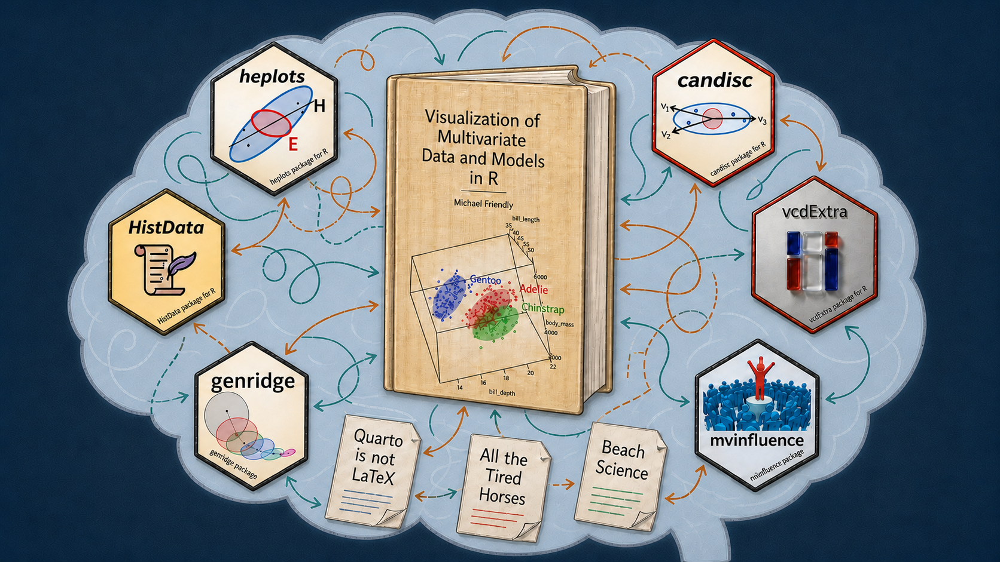

{fig-align="center" width="100%"}

> | 🎵 All the tired horses in the sun
> |    How'm I supposed to get any riding done?
> |    Mm-mm, mm-mm 🎵
>
> --- Bob Dylan, 1970

When I write, my subconscious often thinks about the **writing process**: what it takes to "Get Some Writing Done".
It's not simply about putting words down on a page, or typing them into an editor
or word processor window. Your cognitive focus (your **attention**) on the task often has to deal
with interruptions in the flow of ideas -> tasks-to-do -> final product. The interruptions are like Bob Dylan's Wild Horses;
they are detours along the path to getting it done, DONE, DONE!!!.

Over the years that's meant for me writing [journal articles](https://datavis.ca/papers)  on novel [graphical methods](https://www.datavis.ca/papers/#methods) and the [history of data visualization](https://www.datavis.ca/papers/#history)
[book projects](https://friendly.github.io/books.html), and, now, this [blog](https://friendly.github.io/blog/).
This body of work-- and what I had to do to "Get some writing done"--
is all a happy cognitive family, all alike in some ways, the way siblings share a last name and a few
mannerisms. In writing, they call on the same high-level core cognitive skills: organizing an argument, drafting,
revising, cutting what doesn't earn its place. 

But each type of writing is unhappy, or at least
difficult, in its own particular way -- an article has to survive reviewers looking
for the hole in it, a book has to hold together across three hundred pages and
eighteen months, a blog post has to earn the reader's attention in the first
paragraph or lose it. 

But more to my main point, each form of writing in _my_ work
involves a somewhat different cognitive skill-set, and often different set of software tools,
each one a new wild horse needing to be tamed (understood) and put to work.[^RStuff]

[^RStuff]: In an R environment, this includes R language changes (the `magrittr` pipe `%>%`
giving way to the native pipe `|>`), tidyverse updates (`dplyr` and friends), `ggplot2`
enhancements, and statistical modeling developments (HLMs, Bayesian methods) -- each with its
own learning curve before it earns a place in the workflow.

In this "thinking-about-my-writing-thinking", I'm drawn to John McPhee's [*Draft No. 4: On the Writing
Process*](https://us.macmillan.com/books/9780374537975/draftno4/). It is the best
book-length treatment I know of behind this same restlessness and occasional frustration about how writing actually
gets done. It takes different shapes in various modes of expression, but there are striking similarities.
It's about the tension and friction to move your writing (and software, graphics) closer to
what satisfies you as work well done and can be proud of.

The core skills are probably fine for fiction or non-technical non-fiction. But,
as in my [Vis-MLM book](https://friendly.github.io/Vis-MLM-book/), and others before it
(e.g., [*Discrete Data Analysis with R*](http://ddar.datavis.ca)),
I can't help but think about the *graphical methods* I use for data analysis and
see how they actually work in the context I'm writing about. 

Usually, I can just recall how I did this before, or find a new package that does it better.
The latter involves a small detour: install the package, read the documentation, understand
how to use it, incorporate into my writing and workflow.

But often in this work I have to also wear a Developer hat, because these methods are
new or existing ones suck: they don't allow me to do what I want to write about.
This mean implementing and testing them, writing documentation, publishing to CRAN
before I get back to "real work" and actually use them in my working draft --
this writing process is never just "writing". It's more like a path of stages, perhaps looping backwards:


```{mermaid}
%%| label: fig-writing-straight-line
%%| fig-cap: "The deceptively simple path from writing to explanation."
%%| fig-align: center
%%| fig-width: 10
%%| fig-height: 2.2
%%{init: {"flowchart": {"curve": "linear", "nodeSpacing": 22, "rankSpacing": 38}, "themeCSS": ".stage { filter: drop-shadow(2px 3px 2px #b8c2c2); }"}}%%
flowchart LR
  writing([Writing]) --> idea([Graphic idea]) --> implement([Implement in<br/>software]) --> illustrate([Illustrate with<br/>example]) --> explain([Explain])

  classDef stage fill:#d7eeee,stroke:#276b6b,stroke-width:1.5px,color:#173f3f;
  class writing,idea,implement,illustrate,explain stage;
```


Except it isn't really a straight line at all. Every stage loops back, usually to
"implement" and often all the way back to "writing" itself, because what the software
actually does doesn't match what you wanted to show. Think of each loop-back as a
detour sign on the road from idea to finished post. This one has four of them.

```{mermaid}
%%| label: fig-writing-detours
%%| fig-cap: "The actual route: each later stage can force a return to earlier work."
%%| fig-align: center
%%| fig-width: 10
%%| fig-height: 4.2
%%{init: {"flowchart": {"curve": "basis", "nodeSpacing": 25, "rankSpacing": 55}, "themeCSS": ".stage { filter: drop-shadow(2px 3px 2px #b8c2c2); }"}}%%
flowchart LR
  writing([Writing]) --> idea([Graphic idea]) --> implement([Implement in<br/>software]) --> illustrate([Illustrate with<br/>example]) --> explain([Explain])

  idea ==> writing
  implement ==> writing
  illustrate ==> implement
  explain ==> implement

  classDef stage fill:#d7eeee,stroke:#276b6b,stroke-width:1.5px,color:#173f3f;
  class writing,idea,implement,illustrate,explain stage;
  linkStyle 4,5,6,7 stroke:#b04a3f,stroke-width:3px;
```

<!--
TODO: The Tree of Thought or Garden of Forking Thoughts
  - not just a linear sequence (with possible loops), but maybe more like a tree (different projects or issues in a single one)
  - multitasking, attention switching
  - if a tree, do you go depth-first or breadth-first?
    - example: writing a `vcdExtra` function to plot logistic regression results with the marginal distribution of X shown as
      points, histograms, density curves-- when to stop, promote the function from `dev/` to `R/` and release to CRAN? 
      vs. The Rabbit Hole: Continue to make it more general / useful / beautiful in search of dataviz Bunny Gold.

Here's the email to Gavin that triggered this:

I thought `dev/loghistplot()` was getting nearly ready to move to R/, but then a bunch of synapses spontaneously fired as I was thinking about how this could be made more general/useful/beautiful.

Some of these are in `dev/loghistplot-extensions.md` . One was the idea of allowing `marginal="density"` in the function. I actually like
this best of all. Take a look. There's also a testing script for some of these ideas.

Maybe we've done enough for now on this, and I'll put this into a new vcdExtra v 0.9.8 or even leap to v 1.0.0. The alternative is to keep creeping down the
rabbit hole in search of a golden bunny.
-->

<!--
TODO: Mention how other R datviz books have done things -- but maybe that's another rabbit hole for this post??

- Claus Wilke: Fundamentals of Data Visualization -- no code in the book, great figures
- Kieran Haley:
- Antony Unwin: Graphical Data Analysis with R
-->

## 🚧 Detour 1 — BRIDGE OUT: when the software doesn't do what you need

Most of the time the loop closes quietly -- existing packages do what you need, you
make the figure, you move on. *Vis-MLM* wasn't like that. Working up examples for the
book meant a lot of these breaks from the actual writing, and sometimes the break had
a second break nested inside it: one of my packages, or someone else's, turned out to
have a limitation, or worse, a bug. Then there's a decision to make:

* track down my or their code;
* discover where it was wrong or could be made more general;
* fix it myself (then re-build the package, ...) vs. file an issue or PR for the
  package author (and wait for follow-up).

### `ggbiplot`: The Fork Taken

The clearest example is `ggbiplot`. Biplots show a 2D view of $n$-dimensional data in
a single display, observations and variables together -- exactly the kind of thing
that shows up constantly in the book. The existing package didn't do quite what I
needed, so I forked it, extended it to produce the plots I actually wanted, and
eventually negotiated with the original author to merge the work in and take over as
maintainer. What started as "make one figure for one chapter" ended as an ongoing
maintenance commitment. That's the shape of this kind of detour: it doesn't stay the
size it started at.

### `tinyplot`: A Road Not Taken

In *Vis-MLM*, I've been somewhat graphic-core-agnostic: I use both base R graphics
included in my packages, and notably the excellent [`car` package](https://cran.r-project.org/package=car) for its
rich linear model graphics, but also `ggplot2`-based methods which I generally prefer
for its coherent structure and extensibility.
However, base R graphics are still a considerable chore for things I want to do, but
are quite awkward--- small things like composing a legend with different point symbols
and colors.
<!-- TODO: small example of setting `pch` and `clr` in a `plot()` via indexing vectors. -->

About half-way through writing, a new base-R kid arrived on the block: [`tinyplot`](https://grantmcdermott.com/tinyplot/), a lightweight,
zero-dependency alternative from Grant McDermott that offers automatic grouping (`y ~ x | group`),
easy built-in legends, built-in themes and small-multiples faceting akin to `ggplot2`. 
The [`tinyplot` Gallery](https://grantmcdermott.com/tinyplot/vignettes/gallery.html)
gives some sense of what it can do.

It is now nearly everything I could have wanted for the base-R graphics in the book,
but alas too late to consider. This would have entailed revising roughly ~70 example scripts,
and all the text across many chapters that used those. That detour would have set me back
a long way, so I bid goodbye to that otherwise attractive road. That road will have to  wait
until a 2$^{nd}$ edition.


### Noteworthy Points: A Path Delayed

A smaller but more consequential example is the idea of a _general mechanism_ for flagging and
labeling "noteworthy" observations in a fitted model or a graphic display -- outliers, large
residuals, influential points, and so on -- often crucial to understanding and explaining what
a plot is showing. 

You get a hint of this already in the diagnostic panels produced by
`plot(lm(y ~ x1 + x2 + ...))`, where unusual points get _automatically_ labeled by case name
(but only if your data frame actually has `rownames()`). `plot.lm()` isn't beautiful, but it gets the job done
and you don't have to think much about it, other than select `which` plot types to show,
and the `id.n` number of points to identify.

This facility is one of the most endearing aspects of the [`car` package](https://cran.r-project.org/package=car). Its plotting functions --
`scatterplot()`, `residualPlots()`, `influencePlot()`, and others -- *all* accept an
`id = list(n=, method=, ...)` argument that handles this consistently. `method=` can be `"x"`
or `"y"` (the points furthest from the mean of that coordinate), `"r"` (furthest from zero, as
in a residual plot), `"mahal"` (furthest from the bivariate centroid by Mahalanobis distance),
or your own numeric vector -- Cook's distance, say -- with the largest `n` values labeled.

None of that existed for `ggplot2`, though. Finding and labeling unusual points is another data
step and `geom_*()` you have to wire up yourself, one plot at a time -- every single time!
And worse: because I generally want to explain to the reader how such plots are constructed,
so they can use them in their work, it takes another loop in the cognitive diagram @fig-writing-detours.

I wrote some code for this in `heplots::noteworthy()`, and its `ggplot2`
layer `stat_noteworthy()`. It ports the same vocabulary -- `"mahal"`,
`"x"`, `"y"`, `"r"`, or a Cook's-distance-style numeric vector -- into the grammar of graphics,
so any `ggplot`, similar to `car`'s own base-graphics functions, could get the same treatment. It's
been tested against `peng`, heplots' Palmer-Penguins-style dataset, flagging multivariate
outliers by Mahalanobis distance across the measured variables.

But getting this generally right-- so it worked in situations with a grouping variable,
and in faceted displays turned out to be more difficult than my ggplot skills could satisfy.
Another path put on hold, for the sake of "getting it DONE!"


## 🚧 Detour 2 — SLOW: MERGING TRAFFIC: chasing the data, the perfect image or correct citation

My papers on data visualization history, for example on [Andre-Michel Guerry](https://www.datavis.ca/papers/guerry-STS241.pdf),
[Michael Florent van Langren](https://www.datavis.ca/papers/vita/Friendly-etal2010langren.html), and
[under-recognized heroes](https://www.datavis.ca/papers/Raiders_Lost_Tombs.pdf) -- run into a different kind
of detour. There's a general theme and structure going in, but the devil is in the details
of several recurring tasks, each its own kind of detour.

### Data

My philosophy of historical research often entails tracking down the data behind some great example.
That could mean scraping from an historical document, or digitizing an image, itself implying another set of
skills and tools to learn.

Once I have the data, what should I do with it? I could just make it a dataset in my project, but if it is
also worthwhile to others, I feel a push to put it into an R package, document it and include runnable examples.
Many interesting historical data sets have found their way into the
[`HistData` package](https://friendly.github.io/HistData/).

Datasets related to graphical methods for multivariate data and my Vis-MLM book are included in
the [`heplots`](https://friendly.github.io/heplots/), [`candisc`](https://friendly.github.io/candisc/),
[`genridge`](https://friendly.github.io/genridge/) packages, and those related to categorical
data analysis (and my `psy6136` course) are in [`vcdExtra`](https://friendly.github.io/vcdExtra/)
and its parent [`vcd`](https://cran.r-project.org/package=vcd).

To make these even easier to find and use, a number of these now use
[`@concept`](https://roxygen2.r-lib.org/reference/tags-index-crossref.html) tags in the
documentation, to make them searchable by content topics.

In a minor way, this problem also found its way into `Vis-MLM`. I use the (`palmerpenguins`)[]
dataset for many examples throughout the book. But this is flawed by having variable
names like `bill_length_mm` that include units I wouldn't want to use in graphs; and also 
missing cases that needed to be excluded in every example. My solution was to create
a clean version, `heplot::peng` to rid myself of this wild pony.
In the meantime, some of this has been cleaned-up, now as `datasets::penguins`.


### Images
For historical work, finding suitable reference images to comment on or try to reproduce,
involves another set of tasks.

* find the best reference images available; there are often a bunch available online;
* make sure of sufficient resolution (online vs. print);
* make careful note of the actual image source, for attribution, but also for
  licensing/permission.
  
This is tied to how the images you find are curated:
[davidrumsey.com](https://www.davidrumsey.com/) images, for instance, ship with files describing the exact source, reference, and other attributes. I can download one as a `.zip` file with everything there. 

Not every source is that considerate. I frequently find French material on [`Gallica`](),
but also in ...

### Citations
Tracking down citations -- often difficult in history:

* see/find something worth citing;
* open the reference manager (Jabref, Zotero, ...) to check whether it's already
  there;
* if not, back to search, find it, import it;
* copy the BibTeX entry and merge it into the project's working `references.bib`.
  (A LaTeX workflow can shortcut this by pointing at several system-wide BibTeX
  databases at once; Zotero may make the merge step unnecessary altogether.)

Same tension either way: the detour is legitimate and necessary, and it still pulls
you out of the sentence you were writing.

## 🚧 Detour 3 — MERGE CONFLICT AHEAD: keeping it all in sync

The third kind of friction isn't about content at all -- it's about *where* the work
lives. I work on several computers: home and office desktops and a laptop. But
also with students, research assistants and collaborators. The main points are:

* Syncing work across machines should be _frictionless_, so you always have the most
  recent version, laptop, home desktop, office machine and with collaborators. 
  Cloud alternatives (Dropbox,
  iCloud, OneDrive, Google Drive) handle simple cases, but often introduce another source of friction.
  
* Using version control is one answer. In earlier days R development was centered on SVN and a lot of packages
  were developed and maintained on [R-Forge](https://r-forge.r-project.org/), shortly to be retired. `git` became the answer,
  but it is also cognitively somewhat harder,
  because it changes how you *think* about the work, not just where the
  files sit:
  - who does what?
  - how do you comment on someone else's changes?
  - branches, or does everyone work on `main`?
  - issues tracked directly on GitHub, or somewhere else (e.g, an `issues/` folder inside the repo)

"Merge conflict" is the right sign for this detour twice over -- it's what git calls
it, and it's exactly what it feels like.

<!--
TODO: Find / create image of a sticky note attached to a monitor screen saying: "Did you commit & push?"
  and another saying "Did you pull first?"
-->  

## 🚧 Detour 4 — SEVERAL CREWS WORKING, NO COORDINATION: writing with AI across several sessions at once

This one's new, and it's the one I lived through writing *this very post*. Today
alone: one AI session working through a statistics bug in `vcdExtra`, a second
recording the derivation behind it in a separate project folder, a third -- this one
-- drafting a blog post about a stray idea the first two sessions produced. Three
windows, three separate conversations, none of them aware of the other two unless I
carry the context across myself.

What that actually costs:

* each session's context is local to it -- a fresh window starts from zero and has
  to be re-briefed, even on work from an hour ago in a different window;
* deciding *which* window a given thought belongs in is its own small tax -- is this
  idea part of the current task, or does it want to be its own conversation (a blog
  post, say, spun out of a debugging session);
* the git version of this problem is real, not hypothetical -- more than once today,
  a push from one line of work got rejected because another session (or an automated
  build) had already pushed to the same branch, and pulling first before starting
  something new turned out to be the thing I forgot to do.

None of this is a reason not to work this way -- it's clearly worth it -- but it's a
genuinely new kind of detour sign, one that didn't exist a couple of years ago.

## Exploding Brain Syndrome

{fig-align="center" width="70%"}

None of these four detours is a problem in isolation. The problem is your brain running two or
three of them at once, each with its own open window, a half-finished thought,
marking something as a **TODO**, etc.
There's something genuinely high-dimensional about the state you're holding.
This is itself an interesting problem in cognition. I don't know if this has been studied,
but I'd be willing to donate my brain to science, when I'm done with it. 
(Just hope it wouldn't travel around in a wooden box for as long as Einstein's)

Here's the simplest example: have a thought, find the window that holds it on your computer, edit, or change it.
But "the window" could be the
manuscript text, an RStudio console, the package source, your reference manager, a `bash` terminal `git` session,
and now--- a Claude/Codex AI session that's three exchanges deep into a completely different topic you started earlier.
And there are also forks in the process. The diagram shows just one built into the loop itself: do you commit and push your work here, before
switching context? And, is that its own kind of detour?

```{mermaid}
%%| label: fig-thought-window-edit
%%| fig-cap: "The thought -> window -> edit loop, and how many windows there are to pick from."
%%| fig-align: center
%%| fig-width: 10
%%| fig-height: 6
%%{init: {"flowchart": {"curve": "basis", "nodeSpacing": 22, "rankSpacing": 45}, "themeCSS": ".stage { filter: drop-shadow(2px 3px 2px #b8c2c2); } .window { filter: drop-shadow(2px 3px 2px #b8c2c2); }"}}%%
flowchart LR
  thought([Thought]) --> findw{Find the<br/>window}

  findw --> manuscript([Manuscript])
  findw --> pkg([Package source])
  findw --> refs([Reference<br/>manager])
  findw --> terminal([Terminal,<br/>mid-commit])
  findw --> ai([AI session,<br/>mid-topic])

  manuscript --> edit([Edit])
  pkg --> edit
  refs --> edit
  terminal --> edit
  ai --> edit

  edit --> commit{Commit &<br/>push first?}
  commit -- yes --> push([Commit,<br/>push])
  push ==> thought
  commit == no ==> thought

  classDef stage fill:#d7eeee,stroke:#276b6b,stroke-width:1.5px,color:#173f3f;
  classDef window fill:#f5e6c8,stroke:#a3781f,stroke-width:1.5px,color:#4a3a10;
  class thought,findw,edit,commit,push stage;
  class manuscript,pkg,refs,terminal,ai window;
  linkStyle 13,14 stroke:#b04a3f,stroke-width:3px;
```

And that's before something *new* shows up uninvited -- a paper worth a second look
that turns into an idea for a post, or an R package that looks worth trying, if it
even fits how you already work. Four kinds of detour sign, all visible from the same
stretch of road, is a lot of signs to read at once.

### What this looked like while writing Vis-MLM

{fig-align="center" width="90%"}

## Taming the horses


What those detours and all those wild horses do in your head is to split your attention into
possibly many pieces. Your attention is what you can give thought to and push further along the assembly line to **DONE** check mark somewhere. It is a finite mental resource, so all those pieces compete, like a bunch of toddlers
in a childcare center asking: "Where's my snack?", "When can I play alone, just myself?"

<!--
[NOTES on this]

The exploding brain metaphor suggests:
With the idea of a garden of forking thoughts in mind you can think of pruning branches
to keep the shape more orderly. 

* I could give some task to an RA, as I very often did in writing Vis-MLM. This was often at a
  high-level: Review chapter XX and find inconsistencies, writing or graphics that are inconsistent
  or poorly done. Other tasks were more mundane: [examples here]

* If using AI I could often seek information, guidance, or even suggestions and solutions for
  technical stuff (generalizing a function, writing the documentation, ...)
-->


## How could AI help?

Some of this is squarely in AI's wheelhouse -- searching for images, searching code,
tracking down a reference. Detour 4 above is the more interesting, unresolved
question: if AI sessions are themselves now a source of friction, can AI also help
manage the friction between its own sessions -- carrying context across windows,
noticing when two conversations are circling the same idea? Genuinely don't know yet.

What I do know: this post is itself an example of the good version of Detour 4. It
started as a page of fragments -- half a Dylan lyric, a diagram sketched in ASCII
arrows, "not sure what I meant here" next to a bullet point -- and turning that into
what you're reading now happened in real time, in one of today's three windows,
without needing yet another detour of its own.

<!-- Draft notes / raw fragments for this post are kept in tired-horses.md
     alongside this file, for whatever gets added next. -->
