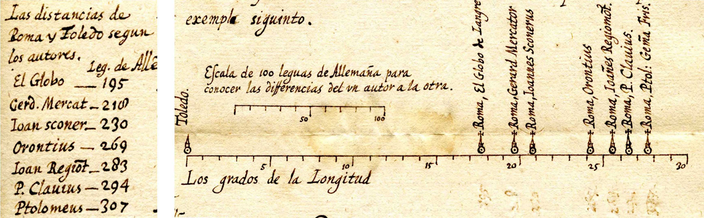
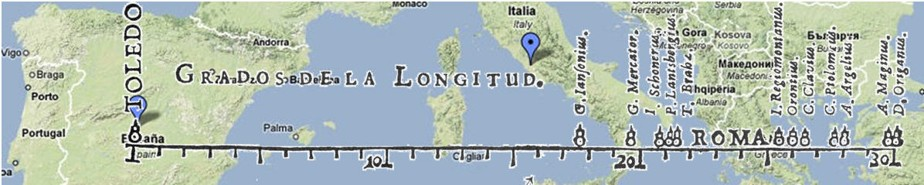
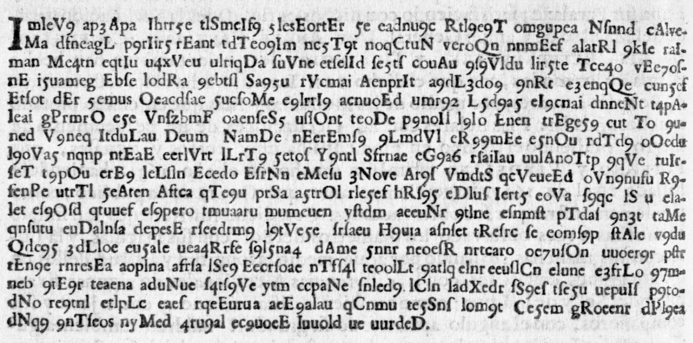
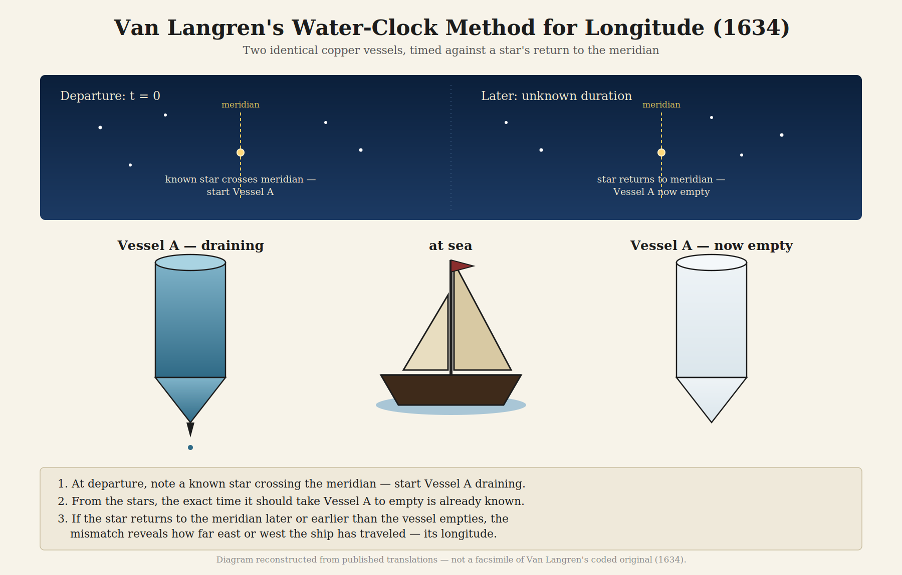
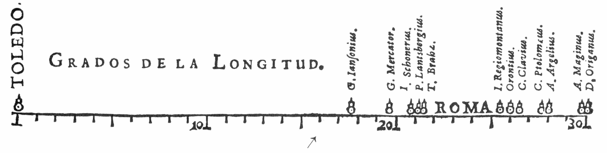

Historians of data visualization live for surprises. Sometimes they're delightful: an unknown fact about a hero of the field, like our discovery of C. J. Minard's burial place in Montparnasse
Cemetery and that his near neighbor there is Andre-Michel Guerry. The story of these and other historical excavations is told in
[Raiders of the Lost Tombs](https://www.datavis.ca/papers/Raiders_Lost_Tombs.pdf).
Or a hero nobody had noticed yet,
like the Hungarian cartographer Imre Milecz, [discovered by Attila Bátorfy](https://attilabatorfy.substack.com/p/could-this-be-the-first-flow-map) to have drawn the first flow map in 1773---decades before the credit usually goes to Minard or [Henry Harnass](http://www.complexcity.info/files/2011/06/harness-1837-flowmap.pdf).
Or Frances Harriet Lightfoot, whose 1831 *An Embellished Chart of General History and Chronology* had gone essentially unknown to modern researchers until [RJ Andrews found it](https://www.chartography.net/p/colossal-chronography).

Sometimes these surprises are more unsettling. The worst is the discovery that we got some piece of the historical record
or our interpretation entirely wrong. **Van Langren's Secret**, for an accurate method of determining longitude at sea, is a surprise of this second kind.

Yet, to an amateur historian like myself, telling the story of this unwelcome surprise itself has a certain
reward. It is not just a matter of correcting the record; more that of an appreciation of
how our understanding of history continues to unfold, as new "data" is uncovered.
Perhaps paradoxically, history is not static.
History is always undergoing reexamination and reconsideration as new facts or perspectives arise. 
This is one such tale.

## How I Got Here

In Dec. 2008 I received an out-of-the-blue email from Joaquín Ibáñez Ulargui, a materials scientist in Madrid. He had been going through the papers of an ancestor---fray Íñigo de Brizuela, President of the _Council of Flanders_ in the 1620s. He had found something odd tucked among them: a letter, from Feb/Mar 1628, in old Spanish, containing a small graph. He wondered if I was interested.  I was indeed! Graduate students at my university were on strike; no classes meant I had plenty of time to consider a new historical hero.

The graph showed seven names, a scale of degrees, a scatter of estimates for the distance in longitude between Toledo and Rome. It looked very much like the famous 1644 diagram in Michael Florent van Langren's [*La Verdadera Longitud por Mar y Tierra*](https://www.datavis.ca/gallery/langren/LaVerdadera.pdf)---except this letter predated that publication by at least sixteen years. The amateur historical sleuth in me was energized!



That email was the seed of a paper Pedro Valero-Mora, Joaquín, and I published in 2010 in *The American Statistician*: ["The First (Known) Statistical Graph: Michael Florent van Langren and the 'Secret' of Longitude."](https://www.datavis.ca/papers/vita/Friendly-etal2010langren.html). 
What was particularly of interest was to understand _why_ van Langren chose to display the previous estimates
of the longitude distance from Toledo to Rome in what would be the **first graphical display of quantitative data**, using a 1D dot plot.
Why didn't he just use a simple table, which was nearly always used at the time. We always ask:

> **What was he thinking?**

Our conclusion was that only a one-dimensional
dot plot of the estimates would show directly what he wanted the King to **see**:
all previous methods were so variable, and therefore with such large errors, as to be useless
for accurate navigation at sea.[^methods] In the version of this graph from 1644, overlaid on the modern map,
you can see how wide
the range of estimates is: over 40% of the range from Toledo to Rome shown.
The pin marks the actual distance, 16^o31'.

[^methods]: The astronomers in van Langren's graph estimated longitude by several methods, all theoretically sound but practically limited: **lunar eclipses** (both observers record local time when the moon enters or exits Earth's shadow — simultaneous everywhere, so the time difference gives the longitude difference, but eclipses are rare); **lunar distances** (measuring the angle between the moon and a reference star, since the moon moves ~0.5° per hour against the stars — proposed by Regiomontanus in the 1470s, but requiring accurate lunar tables that didn't yet exist); and **occultations** (the moon passing in front of a star — sharp-edged and predictable, but again rare). Some estimates were less astronomical still, built up from travellers' accumulated records of distances and directions. Tycho Brahe's estimate, made with the finest pre-telescopic instruments of the age, was the best of the lot — and still badly wrong. That was the point.



We traced van Langren's graph back to its origin in this 1628 patronage letter, sent to Isabella Clara Eugenia, governor of the Spanish Netherlands. van Langren laid out, with more salesmanship than science, the case that longitude determination was a mess, and King Fillipe of Spain
surely needed to solve this for exploration (and plunder!). He said boldly 
that he, Michael Florent van Langren, descendant of great Dutch globe-makers and
mathematician to His Majesty, had found a solution and deserved a reward.

He never said what the fix was. In *La Verdadera*, on page 8, he printed his idea anyway---but in cipher. He told the king he'd reveal the plaintext after suitable compensation. This was a classic request
for patronage, but couched as a puzzle. Except for the puzzle, the [text of *La Verdadera*](https://www.datavis.ca/gallery/langren/verdadera.pdf) reads like a modern grant application.
We reproduced the ciphertext in [our supplementary materials](https://www.datavis.ca/gallery/langren/), posed a few open questions about what kind of cipher it might be, and moved on.

Except I didn't quite move on right away. In 2009 and 2010 I went looking for codebreakers on what the internet was back then, tracking down a handful of people---a few retired from the CIA, a couple from NASA---who I thought might enjoy a fun historical puzzle. Several wrote back, and a few actually gave it a real attempt. But van Langren beat them all. (We'll see why when we get to the final solution.)

{width="80%"}

Here it is as full text, transcribed exactly from page 8---the thing that stumped everyone, including me:

```
ImIeV9  ap3Apa  Ihrr5e  tlSmeIf9  5lesEortEr  5e  eadnu9c  Rtl9e9T  omgupea  Nſnnd  cAlveMa
dfneagL  p9rIir5  rEant  tdTeo9Im  nc5T9t  noqCtuN  veroQn  nnmEef  alarRl  9kIe  raIman
Me4tn  eqtIu  u4xV  eu  ulriqDa  ſuVne  etſelId  ſe5tſ  couAu  9ſ9Vldu  lir5te  Tce4o  vEe7oſnE
i5uameg  Ebſe  lodRa  9ebtſl  Sa95u  rVcmai  AenprIt  a9dL3do9  9nRt  e3enqQe  cun5ef
Etſot  dEr  5emus  Oeacdſae  5ucſoMe  e9lrrI9  acnuoEd  umr92  L5d9a5  eI9cnai  dnneNt  t4pAIeai
gPrmrO  e5e  VnſzbmF  oaenſeS5  uſlOnt  teoDe  p9noIl  l9lo  Enen  trEge59  cut  To  9uned
V9neq  ItduLau  Deum  NamDe  nEerEmſ9  9LmdVl  eR99mEe  e5nOu  rdTd9  oOedu
I9oVa5  nqnp  ntEaE  eerlVrt  lLrT9  5etoſ  Y9ntl  Sfrnae  eG9a6  rſaiIau  uulAnoTtp  9qVe  ruIcſeT
t9pOu  erE9  leLſln  Ecedo  EſrNn  eMeſu  3Nove  Ar9ſ  VmdtS  qcVeueEd  oVn9nufu  R9fenPe
utrTl  5eAten  Aftca  qTe9u  prSa  a5trOl  rle5ef  hRſ95  eDluſ  Iert5  eoVa  ſ9qc  lS  u  elalet
eſ9Oſd  qtuuef  eſ9pero  tmuaaru  mumeuen  yſtdm  aeeuNr  9tlne  eſnmſt  pTdaſ  9n3t  taMe
qnſutu  euDalnſa  depesE  rſeedtm9  l9tVe5e  ſrſaeu  H9uia  aſnſet  tReſrc  ſe  eomſ9p  ſtAle  v9du
Qdc95  3dLloe  eu5ale  uea4Rrfe  ſ9l5na4  dAme  5nnr  neoeſR  nrtcaro  oe7uſOn  uuoer9r  pſtc
tEn9e  rnresEa  aoplna  afrſa  lSe9  Eecrſoae  nTfſ4l  teoolLt  9atlq  elnr  eeuſlCn  elune  e3frLo  97mneb
9tE9r  teaena  aduNue  ſ4tſ9Ve  ytm  ccpaNe  ſnled9  lCln  ladXedr  ſS9eſ  tſe5u  uepuIſ  p9todNo
re9tnl  etlpLe  eaeſ  rqeEurua  aeE9alau  qCnmu  te5Snſ  lom9t  Ce5em  gRoeenr  dPl9ea
dNq9  9nTſeos  nyMed  4ru9al  ec9uoeE  Inuold  ue  uurdeD.
```

Two hundred and four of those space-separated groups, every one of them four to eight characters long, no group repeating often enough to be a common word in any language. Take a minute and look at it before reading on---this is exactly what stared back at van Langren's readers for 376 years.

I assumed, as I think most people who have written about van Langren have assumed, that whatever he was hiding had something to do with the achievement he's actually remembered for: his 1645 lunar map, the first comprehensive survey of the moon's craters and mountains, and the method he spent years trying to build around it---using the sunrise and sunset lines crossing named lunar peaks as a kind of celestial clock, visible everywhere the moon was visible.

It was a reasonable guess, backed by details about the [Alfonsine Tables](https://en.wikipedia.org/wiki/Alfonsine_tables) which  provided data for computing the position of the Sun, Moon and planets relative to the fixed stars.  But it was also wrong.

## The Problem of Longitude

Appreciating what van Langren was hiding requires understanding why **longitude** was
so much harder to measure than **latitude** in the seventeenth century.

**Latitude** is easy: the elevation of the sun, moon, or stars above the horizon tells
you directly how far north or south of the equator you are. Nature provides the reference
frame.

**Longitude** offers no such anchor. There is no natural zero line, and the distance
corresponding to one degree of longitude shrinks from 111 km at the equator to zero at
the poles. What *is* fixed is the relationship between longitude and time: Earth rotates
360° in 24 hours, or 15° per hour, so a difference in longitude translates directly into
a difference in local time:

$$\Delta\text{longitude} = 15° \times \Delta\text{time}$$

This means the general solution requires **two clocks**: one tracking local time (reset
each day by observing solar noon), the other keeping the time at a reference location set
before departure and never touched again:

$$\Delta\text{time} = \text{time}_\text{Here} - \text{time}_\text{There}$$

The difficulty was that no mechanical clock of the era was accurate enough to serve as
the *reference* clock aboard a ship for weeks. The alternative---an *astronomical*
solution---was to use a predictable celestial event (a lunar eclipse, an occultation of
a star by the moon, the moons of Jupiter) as a surrogate reference clock: time the event
locally, look up when it was predicted to occur at the reference meridian, subtract.

Van Langren had spent years perfecting one such method, using (as we thought) the
positions of sunrise and sunset lines crossing named peaks on the lunar surface---which
is why his cipher was so unexpected. What he had chosen to hide was neither the lunar
method nor a mechanical clock. It was a water clock.

## The Cipher Falls

Eleven years after our paper---long enough that I had filed the cryptogram away as one of those historical loose ends nobody would ever tie off---I learned that it had been solved. Not by a historian of science. By a Belgian warehouse worker and amateur cryptographer who loved a good puzzle.

The backstory has its own small comedy of persistence. Klaus Schmeh, a German cryptology writer who maintains a blog called [*Cipherbrain*](https://scienceblogs.de/klausis-krypto-kolumne/), had stumbled on the van Langren cipher in 2015 and flagged it as a genuinely interesting unsolved historical cryptogram that nobody in the crypto world seemed to know about. An Antwerp amateur astronomer, Jos Pauwels, took an interest and kept it alive. [Dirk Huylebrouck](https://dirkhuylebrouck.be/), a mathematician at KU Leuven, had been shopping the puzzle around online forums for the better part of a decade, by his own account without success.

Then, in December 2020, a trio of codebreakers---David Oranchak, Sam Blake, and a Belgian warehouse operator and programmer named Jarl Van Eycke---who had cracked the [Zodiac Killer's notorious Z340 cipher](https://arxiv.org/pdf/2403.17350)[^zodiac], a 340-character code unsolved for 51 years. Huylebrouck read the news, tracked down Van Eycke, and handed him the _van Langren Code_.

[^zodiac]: The Zodiac Killer is one of the infamous unsolved mysteries in American criminal history.
In the San Francisco Bay area in the 1968--1969s, this unknown murder killed at least five people.
Seeking public attention, he sent cryptic ciphers to newspapers and taunted police with letters
describing his acts. Van Eycke's solution was hailed as a break-through in amateur cryptographic circles.

Van Eycke solved it in about a week!

His approach was pure applied cryptanalysis, and it's worth walking through because it's a small master class in how you break a cipher with no known key and no certainty about what kind of cipher it even is. 

* He started by noticing that the "words" in the transcribed ciphertext were suspiciously uniform in length---a giveaway that the spacing was cosmetic, meant to look like word breaks without being so. 
* He stripped the spaces and ran statistical tests for [periodic transposition](https://en.wikipedia.org/wiki/Transposition_cipher), the classic technique of simply reordering letters rather than substituting them. Nothing came of this.
* He then tried removing different classes of symbols to see what improved the letter-trigram statistics[^trigram]. He found that the capital letters scattered through the text were pure decoys---meaningless once removed. 
* With capitals and spaces both gone, he tried reading the remaining letters at different intervals, and found that taking every third letter suddenly produced recognizable fragments of real words.

[^trigram]: In cryptography, letter-trigram statistics involve measuring the frequency of overlapping three-letter sequences in a language (e.g., "the," "and"). Analysts use these patterns as a "fitness score" to evaluate text coherence. If a proposed decryption matches the statistical probability of real-language trigrams, the plaintext is considered a valid decoding. A useful introduction to historical cryptography is
Nigel Smart's [*Cryptography: An Introduction*, Ch 3](https://www.cis.upenn.edu/~sga001/classes/cis331f19/resources/smart_ch3.pdf)

That was the structural key: the plaintext had been split across three interleaved streams before a final substitution---digits standing in for letters---was layered on top. Once he had the interleaving and the substitution, the message resolved into continuous prose. And the prose wasn't in the Spanish that both van Langren's introduction and our own paper had led everyone to expect. It was seventeenth-century French. _Quelle surprise!_
It is of some interest to show some of these steps using R.

A quick note on sourcing before I reproduce any of this: Van Eycke never published his own account of the break. Every version of this story, including mine, traces back to [Klaus Schmeh's *Cipherbrain* post](https://scienceblogs.de/klausis-krypto-kolumne/jarl-van-eycke-solves-400-year-old-longitude-message/), which is Schmeh's own paraphrase of "a detailed description" Van Eycke sent him by email---not a verbatim quote, and not self-published. With that caveat, here's what happens when you run Van Eycke's described steps against the actual ciphertext from our 2010 supplementary materials.

### Step 1: the "words" are a decoy

Check the distribution of "word" length in the cipher.

```{r word-lengths}
cipher_raw <- readLines("cipher-transcription.txt", encoding = "UTF-8") |> paste(collapse = " ")
tokens <- strsplit(cipher_raw, "[ \t]+")[[1]]
tokens <- tokens[tokens != ""]
tab <- table(nchar(tokens))
m <- rbind(nchar = as.integer(names(tab)), freq = as.integer(tab))
colnames(m) <- rep("", ncol(m))
m
cat("Total tokens:", sum(tab), "\n")
prop_4_8 <- sum(tab[names(tab) %in% as.character(4:8)]) / sum(tab)
cat(sprintf("Proportion with 4-6 characters: %.1f%%\n", 100 * prop_4_8))
```

`r length(tokens)` "words," and the lengths cluster almost entirely between 4 and 8 characters. You can actually see this narrow range of word lengths in the "rivers" of spaces that run down the lines in the cipher text. In French prose (the plaintext language, as it turns out), roughly 30% of words are 1–2 letters---*de*, *en*, *le*, *il*, *se*, the connective tissue of any sentence. In the cipher, barely 3% are that short; the rest pile up in the 4–8 character range at a frequency no natural language produces. The spacing is decorative and purposely deceptive, not linguistic.

| Length | English | French | Spanish | German | Langren  |
|--------|--------:|-------:|--------:|-------:|---------:|
| 1–2    | 25      | 30     | 25      | 20     | [**3**]{style="color:red"}    |
| 3–5    | 40      | 38     | 40      | 32     | 41                            |
| 6–9    | 28      | 24     | 27      | 35     | [**55**]{style="color:red"}   |
| 10+    | 7       | 8      | 8       | 13     | [**\<1**]{style="color:red"}  |

: Approximate word-length distributions (% of tokens), European languages vs. van Langren's cipher.

### Step 2: strip spaces and decoy capitals

Removing the space characters and capital letters in the ciphertext is easily handled
by `gsub()`, mapping these into NULL ("") characters.

```{r strip-capitals}
nospace <- gsub("[ \t]+", "", cipher_raw)
nocaps <- gsub("[A-Z]", "", nospace)
substr(nospace, 1, 60)
substr(nocaps, 1, 60)
```

Van Eycke also found that the capital letters sprinkled through the text carried no useful information. 
They were pure noise, meant to further deceive any rival who would try to steal his thunder.[^other-ciphers]
Deleting these leaves a single unbroken run of `r nchar(nocaps)` lowercase letters, long-s (ſ) characters, and digits.

[^other-ciphers]: The practice of hiding a priority claim in a cipher was not unique to van Langren. Galileo registered his 1610 observation of Saturn's peculiar shape as a 37-letter Latin anagram (*Altissimum planetam tergeminum observavi* --- "I have observed the highest planet three-formed" --- what he had actually seen were the rings). Robert Hooke published his law of elasticity as the anagram *ceiiinosssttu* in 1676, decoding it two years later as *ut tensio, sic vis* ("as the extension, so the force"). In each case the goal was the same: hold the date of discovery in escrow without giving anything away.

### Step 3: split into three interleaved streams

```{r three-streams}
chars <- strsplit(nocaps, "")[[1]]
n <- length(chars)
stream1 <- paste(chars[seq(1, n, by = 3)], collapse = "")
stream2 <- paste(chars[seq(2, n, by = 3)], collapse = "")
stream3 <- paste(chars[seq(3, n, by = 3)], collapse = "")
substr(stream1, 1, 60)
```

Taking every third character---positions 1, 4, 7, ...---out of that run produces `stream1` above. It's still not readable, but the letter patterns already look far more like language than the raw ciphertext did.

### Step 4: undo the digit substitution

The last layer is a simple key: 1 = a, 2 = b, ... 9 = i. Concatenate the three streams in order and substitute. I use a bit of extra work to highlight the section that mentions his method, shown below
in French and English

```{r digit-substitution}
#| results: asis
plain_raw <- paste0(stream1, stream2, stream3)
digit_map <- setNames(letters[1:9], as.character(1:9))
plain_chars <- strsplit(plain_raw, "")[[1]]
subbed <- vapply(plain_chars, function(ch) {
  if (ch %in% names(digit_map)) digit_map[[ch]] else ch
}, character(1))
plain_final <- gsub("ſ", "s", paste(subbed, collapse = ""))

# text to highlight
excerpt <- substr(plain_final, 533, 940)
target  <- "langrendictqvonfairadeuxuisesdecuiuredesemblablecipaciteenformedecelindre"

width  <- 68
n      <- nchar(excerpt)
starts <- seq(1, n, by = width)
tpos   <- regexpr(target, excerpt, fixed = TRUE)
ts     <- as.integer(tpos)          # -1 if not found
te     <- if (ts > 0L) ts + nchar(target) - 1L else -1L

esc <- function(x)
  x |> gsub(">", "&gt;", x = _, fixed = TRUE) |>
       gsub("<", "&lt;", x = _, fixed = TRUE) |>
       gsub("&", "&amp;", x = _, fixed = TRUE)

lines_html <- vapply(starts, function(ls) {
  le  <- min(ls + width - 1L, n)
  txt <- substr(excerpt, ls, le)
  os  <- max(ls, ts);  oe <- min(le, te)
  if (ts > 0L && os <= oe) {
    is <- os - ls + 1L;  ie <- oe - ls + 1L
    paste0(esc(substr(txt, 1L,      is - 1L)),
           "<mark>", esc(substr(txt, is, ie)), "</mark>",
           esc(substr(txt, ie + 1L, nchar(txt))))
  } else {
    esc(txt)
  }
}, character(1))

cat('<pre style="background:#f8f8f8;padding:0.6em;border-radius:4px;font-size:0.85em;">\n',
    paste(lines_html, collapse = "\n"), '\n</pre>\n', sep = "")
```

Even with the word breaks still missing and a rough patch or two (likely a transcription slip somewhere in the 2010 `cipher.txt`, fifteen years old at this point), real seventeenth-century French is unmistakably there: *estoilles* (stars), *meridon* [méridien], and then---right on cue---

| | |
|:---|:---|
| **French** | *...florenc[ius] ouan langren dict qu'on faira deux uises de cuiure de semblable c[a]pacite en forme de celindre...* |
| **English** | "Florentius van Langren says one shall make two vessels of copper of similar capacity in the form of a cylinder." |

That's the same instruction already quoted in English translation above, arriving from the other direction, out of a 380-year-old jumble of letters and digits.

## What van Langren Was Hiding

The plaintext, once unwound, turns out to describe not a lunar method at all, but a **24-hour water clock*.
It reads:

> Make two cylindrical copper vessels of equal capacity, each with a conical point at the bottom and a small hole at the center of that point. Fill them with seawater and let them drain. At departure, start the first vessel running while noting which known star sits on the meridian. That vessel will run empty in exactly 24 hours of sidereal time---the interval for a star to return to the same meridian. The moment the first vessel empties, start the second. 

> Do this daily throughout the voyage. Each time a vessel empties, compare the position of the reference star against the meridian to read off how many degrees of longitude have been traveled from the port of departure. A small cork float, riding on the water inside, marks the level so the moment of emptying can be seen precisely.

It's a genuinely clever idea---use the fixed 24-hour sidereal rotation of the stars as an external check on a mechanical timer, rather than trying to keep time some other way and then comparing it to solar noon. But it's built on the oldest timekeeping technology available to him, and that, I think, is exactly why nobody guessed it. Van Langren is remembered---by me among others---for looking *up*, at the moon and using those observations for his method.

It turned out that his "secret" had him looking at a copper cone and a dripping hole, a technology already two thousand years old when he was born. 

Here is a visual depiction of what van Langren was thinking:

{width="80%"}

## A Digression on Water and Time

The [clepsydra](https://en.wikipedia.org/wiki/Clepsydra)---Greek for "water thief"---is one of the oldest instruments humans built for a purpose other than agriculture or shelter. The earliest known example comes from the tomb of [Amenhotep I](https://en.wikipedia.org/wiki/Amenhotep_I) in Egypt, around 1500 BCE; water clocks appear independently in China at roughly the same remove. The basic principle never changed across three millennia: water drains from, or fills, a graduated vessel at a controlled rate, and the level tells you how much time has passed.

What did change was the engineering. [Ctesibius of Alexandria](https://en.wikipedia.org/wiki/Ctesibius), in the third century BCE, added a second catch-vessel and a float mechanism, and eventually gears and a waterwheel to correct for the fact that Greek "hours" were a twelfth of daylight and therefore changed length with the seasons. Roman magistrates used clepsydras to time court speeches; ancient Greek naval crews used them to mark watch rotations at sea. So van Langren, whatever else he was doing, was not innovating the *application*, only the specific protocol for the longitude problem.

Chinese engineers under the [Song dynasty](https://en.wikipedia.org/wiki/Song_dynasty) built cascading, multi-stage clepsydras accurate enough to drive astronomical demonstration devices. The Han-dynasty court astronomer [Huan Tan](https://en.wikipedia.org/wiki/Huan_Tan) was already writing, two thousand years before van Langren, about how temperature affected the flow rate of water clocks and threw off their accuracy against a sundial.

That last detail matters most of all, because it was already the known Achilles' heel of the technology, and it is compounded at sea by something no clepsydra maker on dry land ever had to solve: **motion**. Van Langren's copper cones, however precisely matched at the maker's bench, would have run at different rates within days — slowing as water pressure fell with the draining vessel, drifting further with the temperature swings between day and night, and lurching unpredictably with every pitch of the ship in a swell. 

The arithmetic is unforgiving: four minutes of accumulated time error equals one degree of longitude, and no clepsydra could hold rate reliably enough over a week at sea to stay within that margin, for reasons no amount of careful calibration in an Antwerp workshop could fix. It is a method that works beautifully at a desk and fails exactly where it needed to succeed.


::: {style="float: right; margin: 0 0 1em 1.5em; width: 30%;"}
.](images/Harrison-H1_low_250.jpg)
:::
Van Langren wrote his cipher in the early 1630s. [Christiaan Huygens](https://en.wikipedia.org/wiki/Christiaan_Huygens) would not patent the [pendulum clock](https://en.wikipedia.org/wiki/Pendulum_clock)---the device that finally offered land-based timekeeping precise enough to matter---until 1656. The ultimate solution lay in
an accurate [marine chronometer](https://www.rmg.co.uk/stories/time/harrisons-clocks-longitude-problem), which was still more than another century away (1736), awaiting the master clockmakter [John Harrison](https://en.wikipedia.org/wiki/John_Harrison) to build his "H1".

At the moment van Langren guarded his secret, the water clock was not an anachronism. It was still, in a sense, the state of the art in a world without anything better. He just happened to be trying to make it do a job---hold time steady on a heaving ship for weeks---that nothing built before the eighteenth century could actually do.

## Every Cipher Tells a Story

I keep coming back to the epigraph we used to open the 2010 paper, borrowed a little irreverently from Rod Stewart: *every picture tells a story*. It turns out the same is true of every cipher, and this one told two stories at once. The first is about van Langren himself---a man who staked years of court patronage on a secret that turned out to be an old idea applied to an impossible environment; and one who is, with some justice, remembered instead for the achievement he didn't encrypt: the first comprehensive map of the moon.

The second story is about the people who finally read it. Not a professional historian of science, not a specialist in seventeenth-century cryptography, but a chain of amateurs and one extraordinarily talented codebreaker: an astronomy hobbyist who wouldn't let the puzzle drop, a mathematician who spent a decade asking strangers on forums for help, and a warehouse worker in Flanders who had, a few weeks earlier, helped unmask a serial killer. Joaquín's ancestor's papers gave us the graph's true origin in 2009. Jarl Van Eycke's week of work gave us, in 2021, the thing van Langren had been most careful to hide, and the thing I, writing about him in the years between, was never able to find.

## Bonus: Reproducing Langren's 1644 Graph

Reproducing a historical graph with modern tools is not just technical imitation.
In my paper ["A Brief History of Data Visualization"](https://www.datavis.ca/papers/hbook.pdf)
[@Friendly:2006:hbook] I describe an approach I call **understanding through reproduction**
(or *re-visioning*): remaking a historical graph
from the ground up---with current data and software---as a way of answering the historian's
perennial question, *what was he thinking?* 

The attempt to reproduce forces you to make the
choices the original maker faced: what to show, how to encode it, what to leave out.
Those choices, and the difficulty of getting them right, reveal the intellectual and
graphical constraints of the time. The method can reveal hidden insights, help
to appreciate the historical ingenuity and sheer brilliance of hand-drawn graphics and reveal design flaws, such as distorted scales. Sometimes, the code you write to reproduce a graph

For van Langren's 1D dot plot the exercise is particularly instructive. The graph had no
precedent---he was inventing a form, not following one. Try to re-create it and you realize
almost immediately why a table of twelve longitude values would not have made his point: a
column of numbers, however sorted, tells you nothing at a glance about their spread.

Only when you place them on a common scale does the argument become visible---the estimates
are scattered across nearly the entire plausible range, and *that* is precisely van Langren's case to
the King.

The data behind van Langren's famous 1D dot plot are in `HistData::Langren1644`, which also
provides the Google map image used here as a backdrop. The plot is built up in three layers.
We define a helper function for each layer so the cumulative build-up can be shown cleanly.

```{r langren-setup}
library(jpeg)
library(HistData)
data(Langren1644)

# translate degrees longitude → pixel x-coordinate
xlate <- function(x) 131 + x * 726 / 30

# Read image once globally so gdim is available for fig-asp chunk sizing
gimage <- readJPEG(system.file("images", "google-toledo-rome3.jpg", package = "HistData"))
gdim   <- dim(gimage)[1:2]   # NB: readJPEG returns y, x, colors

draw_map <- function() {
  op <- par(bty = "n", xaxt = "n", yaxt = "n", mar = c(0, 0, 0, 0))
  plot(c(1, gdim[2]), c(1, gdim[1]), type = "n", ann = FALSE, asp = 1)
  rasterImage(gimage, 1, 1, gdim[2], gdim[1])
  invisible(op)
}

add_cities <- function() {
  points(rbind(c(131, 59), c(506, 119)), cex = 2)
  text(131, 95,  "Toledo", cex = 1.5)
  text(506, 104, "Roma",   cex = 1.5)
}

add_dotplot <- function() {
  lines(data.frame(x = c(131, 856), y = c(52, 52)))
  ticks <- xlate(seq(0, 30, 5))
  segments(ticks, 52, ticks, 45)
  text(ticks, 40, seq(0, 30, 5))
  text(xlate(8), 67, "Grados de la Longitud", cex = 1.7)
  points(x = xlate(Langren1644$Longitude), y = rep(57, nrow(Langren1644)),
         pch = 25, col = "blue", bg = "blue")
  text(x = xlate(Langren1644$Longitude), y = rep(57, nrow(Langren1644)),
       labels = Langren1644$Name, srt = 90, adj = c(-.1, .5), cex = 0.8)
}
```

(This way of "parsing" an historical plot into meaningful functions is one we also use in `HistData` to re-vision
[John Snow's Cholera dot plot](https://friendly.github.io/HistData/reference/Snow.html), and [Minard's March on Moscow graphic](https://friendly.github.io/HistData/reference/Minard.html).)

**Step 1:** Draw the background map. `readJPEG()` returns a pixel array; the plot device
is scaled to those pixel dimensions (with `asp = 1`) so later additions can be placed by
pixel coordinate.

```{r langren-step1}
#| fig-asp: !expr gdim[1]/gdim[2]
draw_map()
```

**Step 2:** Mark Toledo and Rome. Their pixel positions were measured from the image,
with the origin at the bottom-left corner.

```{r langren-step2}
#| fig-asp: !expr gdim[1]/gdim[2]
draw_map()
add_cities()
```

**Step 3:** Overlay the 1D dot plot. `xlate()` maps each astronomer's longitude estimate
(in degrees) to a pixel x-coordinate. Names are rotated 90° to avoid overlap.

```{r langren-step3}
#| fig-asp: !expr gdim[1]/gdim[2]
draw_map()
add_cities()
add_dotplot()
```

The wide scatter of the estimates---spanning nearly half the Toledo-to-Rome range---is
exactly the argument van Langren was making to the King: previous methods were hopelessly
variable, and someone (him) deserved a reward for having a better one.

### "I did that better by hand!"

The map overlay above answers the *argument* well enough. But re-visioning in the deeper
sense means trying to reproduce the *artifact*---the spare white strip, the figure-8
snowman markers, the italic lettering. Imagine showing van Langren the map overlay;
he studies it for a moment and turns up his nose and says: 

> *"I did that better by hand!"*

He has a point. Each of his snowman markers was hand-engraved on a copper plate; each name
individually scratched in by the engraver. The uniformity `ggplot2` achieves in milliseconds would have taken hours of skilled
labour in 1644. So: how close can we get?



The reproduction uses a handful of `ggplot2` techniques worth noting:

- **Period font**: the `showtext` package loads *IM Fell English* from Google Fonts,
  a typeface digitised from the Fell collection donated to Oxford University Press in
  1686---forty-two years after *La Verdadera* was printed, but as close in spirit as
  a free font gets.
- **Arbitrary geometry via `annotate()`**: the axis line, minor tick marks, and major
  ticks are plain `"segment"` annotations rather than the usual ggplot2 axis machinery,
  which gives exact control over length and position. Fixed text labels---*TOLEDO.*,
  *ROMA*, *Grados de la Longitud.*---are placed the same way, with `hjust`, `vjust`,
  and `angle` set individually.
- **Snowman markers**: van Langren's figure-8 data symbols are approximated by two
  stacked `geom_point()` calls, one per astronomer---a filled body circle sitting on
  the axis and a smaller hollow head circle above it. `coord_fixed(ratio = 1)` locks
  the x and y scales to the same physical size so the circles stay round and the
  overall strip proportions match the original's roughly 5:1 width-to-height ratio.

```{r langren-ggplot}
#| fig-width: 7
#| fig-asp: !expr 7.5 / 35
library(ggplot2)
library(showtext)

font_add_google("IM Fell English", "imfell")
showtext_opts(dpi = 96)   # match Quarto HTML default; fixes font size vs RStudio mismatch
showtext_auto()

roma_x    <- 23.5          # van Langren's placement
true_long <- 16 + 31/60   # true distance, unknown at the time
body_size <- 4.0;  head_size <- 2.5
body_y    <- 0.50; head_y    <- 0.80

ggplot(Langren1644, aes(x = Longitude)) +
  annotate("segment", x = 0, xend = 32, y = 0, yend = 0, linewidth = 0.6) +
  annotate("segment",
    x = seq(0, 32, 1), xend = seq(0, 32, 1),
    y = 0, yend = -0.15, linewidth = 0.3) +
  annotate("segment",
    x = c(10, 20, 30), xend = c(10, 20, 30),
    y = 0, yend = -0.35, linewidth = 0.6) +
  annotate("text",
    x = c(10, 20, 30), y = -0.6,
    label = c("10.", "20.", "30."), family = "imfell", size = 3.5) +
  geom_point(aes(y = body_y),
    shape = 21, size = body_size, fill = "black", color = "black", stroke = 0.8) +
  geom_point(aes(y = head_y),
    shape = 21, size = head_size, fill = "white", color = "black", stroke = 0.8) +
  annotate("point", x = 0, y = body_y,
    shape = 21, size = body_size, fill = "black", color = "black", stroke = 0.8) +
  annotate("point", x = 0, y = head_y,
    shape = 21, size = head_size, fill = "white", color = "black", stroke = 1.0) +
  geom_text(aes(y = head_y + 0.35, label = paste0(Name, ".")),
    angle = 90, hjust = 0, vjust = 0.5,
    family = "imfell", size = 4, fontface = "italic") +
  annotate("text", x = -0.8, y = 3.5,
    label = "TOLEDO.", angle = 90, family = "imfell", size = 4.2, fontface = "bold") +
  annotate("text", x = roma_x, y = 0,
    label = "ROMA", family = "imfell", size = 4.2, fontface = "bold", vjust = 2.0) +
  annotate("text", x = 6, y = 2.8,
    label = "Grados de la Longitud.",
    family = "imfell", size = 6.6, hjust = 0, fontface = "italic") +
  # arrow below the axis marking the true distance (16°31'), unknown to van Langren
  annotate("segment",
    x = true_long, xend = true_long, y = -0.9, yend = -0.4,
    arrow = arrow(length = unit(0.15, "cm"), type = "open"),
    linewidth = 0.5) +
  coord_fixed(ratio = 1, xlim = c(-2, 33), ylim = c(-1.0, 6.5), expand = FALSE) +
  theme_void()
```

Van Langren would still turn up his nose---the font is only a close cousin of his
printer's type, and his snowman markers were hand-punched where ours are computed
circles. Moreover, if I showed him the `ggplot2` code, he might say, "What a lot
of trouble to do what I did lovingly by hand." 
He's got a point: the 80/20 rule (or [Pareto Principle](https://en.wikipedia.org/wiki/Pareto_principle)) for data graphics says
that you can achieve 80% of your graphic design with 20% of the work, but
it takes the remaining 80% of work to perfect it.

Nevertheless the argument the graph was built to make comes through regardless: twelve
authorities, strung across more than fifteen degrees, and not one of them close to the
true answer of 16°31'.

## Coda

Van Langren hid his method and published his graph in letters to the King. History can now remember it the right way around.

The cipher protected an idea that the technology of the seventeenth century made unsuitable---copper cones that couldn't hold time steady on a heaving ship. His method was guarded for nearly four centuries by an ingenious three-layer scramble. The graph, printed openly on the same page, showed only the *problem* he claimed to solve. 

That graph is the earliest known statistical graph, which was exactly the right tool for communicating
the nature of the problem.
The cipher, finally decoded, shows a man who understood the longitude problem deeply enough to devise a plausible solution, but who was simply working with tools the task made impossible. His mistake wasn't foolishness; it was reasonable given the tools available. And our mistake, to interpret the cipher as describing a lunar method, was equally reasonable given what we could read.

What van Langren is actually remembered for, when he's remembered at all, is his 1645 *Selenographia* — the first detailed map of the moon, with craters named after European monarchs and scientists, strategic flattery disguising a petition. The longitude method failed; the map endures, as does the name of the lunar crater
_Langrenus_, a prominent, 132-km-wide impact crater located near the eastern lunar limb on the shores of _Mare Fecunditatis_. 

The answer to the question historians always ask--- *what was he thinking?* --- turns out to be: something clever, impractical, and beautifully encrypted. The shock of finding our interpretation wrong is replaced, in the end, by a feeling of satisfaction in being able to right the ship of history.
