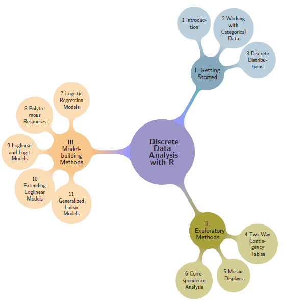

<a href="https://friendly.github.io/Vis-MLM-book/"></a>
🧊 I've been writing [*Visualizing Multivariate Data and Models in R*](https://friendly.github.io/Vis-MLM-book/)
(CRC Press / Chapman & Hall, in preparation) for several years now. I'm now making a (hopefully final) pass on editing.
The book uses [Quarto](https://quarto.org/) to produce both a print-quality PDF and a free
online HTML version from a single source. My skills as graphic book designer are limited, but I'm somewhat of
a perfectionist, and I want both versions to be visually appealing as well as useful to convey the ideas
of visual thinking for multivariate models and techniques for understanding those in insightful graphic displays.

That Quarto promise: **write once, render to multiple formats** is so attractive! Exactly what I wanted.

In practice, it
turned out to be less simple than advertised, when you go beyond the basics and want to introduce features of
page or book design or have content (like animated graphics or tabset displays) that can occur in an online version,
but not in a print copy.

This post introduces a series, **The Making of Vis-MLM**, on the technical challenges of
writing a complex book in Quarto: what I've learned, and how I solved (or am still solving) them.
It is a thoroughly "Down in the Weeds; TL;DR; Book-geek" view of this writing process.
I hope it's useful to others attempting something similar.
It will serve an outline of topics and technical issues I've been working on. I'll write up some of these, when I get a
Round Tuit.

## The choice of Quarto

<a href="https://www.taylorfrancis.com/books/mono/10.1201/b19022/discrete-data-analysis-michael-friendly-david-meyer"></a>
My previous book, [*Discrete Data Analysis with R*](https://www.taylorfrancis.com/books/mono/10.1201/b19022/discrete-data-analysis-michael-friendly-david-meyer),
was written in `.Rnw` — LaTeX with embedded R code chunks processed by knitr.
The pipeline was transparent:

```
.Rnw → knitr → .tex → LaTeX → BibTeX → LaTeX → PDF
```


Every step was explicit. I could run them individually, inspect intermediate files,
and control every detail of layout and typography.
I was able to design custom visual chapter headers, part-page spreads with color schemes,
and a comprehensive dual-index (Subject + Author) using standard LaTeX packages.
It's the book I'm most proud of. I could also easily use [Tikz](https://tikz.net/) to create
_visual_ tables of contents for the whole book, chapters within each part, and the sections in a chapter.

On the other hand, to provide something online,
I had to create a [companion website](http://ddar.datavis.ca/), showing some figures,
R code, and other resources. I also prepared an Instructor's Solution Manual for exercises in the book,
but that was another afterthought. Yet, the framework of the DDAR GitHub repo made this easier to work on
with my co-author.

### What's differfent with Quarto?

With Quarto, the pipeline becomes something like:

```
.qmd → knitr → pandoc → .tex → XeLaTeX → makeindex → PDF
              ↓
             HTML
```

Pandoc acts as an opaque intermediary between your Markdown source and the LaTeX
that XeLaTeX compiles. That extra layer is what buys you the HTML output--- but
it also means that some things which were trivial in `.Rnw` can become genuinely difficult.

I chose Quarto because I wanted the online version to be a first-class citizen,
not an afterthought as with DDAR.
The trade-off turned out to be steeper than I expected.
The series covers issues where this tension arose in practice, and what I did about it.


## Posts in this series

The topics below are drawn from the working notes in my book repository.
As I write them up, they will become links to full posts.

**Setting up and getting started**

- *Starting from the CRC bare-bones Quarto template*:
  What it provides, what it doesn't, and what I had to figure out on my own

- *Quarto is not LaTeX, however hard it tries*:
  A broad comparison of the `.Rnw` and Quarto workflows; what I gained and lost

- *Getting HELP*: 
  Notes on where I asked questions and how this went: Stack Overflow (`knitr`, `ggplot2`),
  TeX Stack Exchange, Quarto Dev discussion, ggplot extenders club, Claude.

- *You can't keep your Quarto project on Dropbox*:
  File locking, sync interference, and why `git` is now my only sync mechanism

**Indexing**

- [*Creating book indexes in Quarto*](../2026-04-quarto-indexes/index.qmd)
  R helper functions, LaTeX macros, and the underscore problem
  

- *The author index disaster*:
  Five things that break simultaneously when you move from BibTeX to pandoc citeproc to create an author index,
  and how I worked around each one

**The build pipeline**

- *Two weeks in Quarto/Pandoc/LaTeX hell* —
  tracking down `Extra }, or forgotten \endgroup` across three tool layers

- *The mysterious freeze cache* —
  how Quarto's execution cache can silently hold stale output,
  and why changing `common.R` doesn't always change your PDF

- *Build workflow fragility* —
  why there's no Makefile, why the PDF must be closed before every build,
  and the `index.pdf` vs `Vis-MLM.pdf` naming confusion

**Writing for two formats**

- *Conditional content: HTML vs PDF* —
  using `::: {.content-visible when-format="html"}` for animated graphics,
  tabsets, and things print can't do

- *Links become dead text in print* —
  how `[text](url)` renders in HTML but needs to become a footnote in the PDF,
  and the search for a systematic solution

- *Formatting R package, dataset, and function names* —
  replacing the single `.Rnw` `\pkg{}` macro with an R function that
  handles HTML color, PDF typeface, indexing, and first-use citation

**Layout and typography**

- *Figure sizing for two formats* —
  what looks right in HTML often needs different dimensions in the PDF,
  and strategies for managing this across 15 chapters

- *Color in figure captions and text* —
  `colorize()`, conditional HTML/PDF output, and why this is harder than it looks

## Things Quarto does well

In fairness: Quarto's HTML output is excellent (and PDF output is pretty decent, when properly configured in your `_quarto.yml` file):

* Equations, code folding, callout blocks, tabsets, and cross-references work beautifully
with minimal configuration.

* Publishing to GitHub Pages (or elsewhere) from `docs/` is nearly effortless.
Single-source, dual-output, when it works, is genuinely valuable.
Most of the book's content works for both formats without any conditional blocks,
but conditional blocks allow for differences between the two.

The problems arise at the edges: complex indexing, fine typography, external LaTeX tools,
and the Windows build environment. The edges happen to be where a serious print book lives.

## Following along

The online version of the book is at <https://friendly.github.io/Vis-MLM-book/>.
If you're writing a technical book in Quarto — especially one targeting both print and HTML —
I hope this series saves you some of the time I've spent in the weeds.
