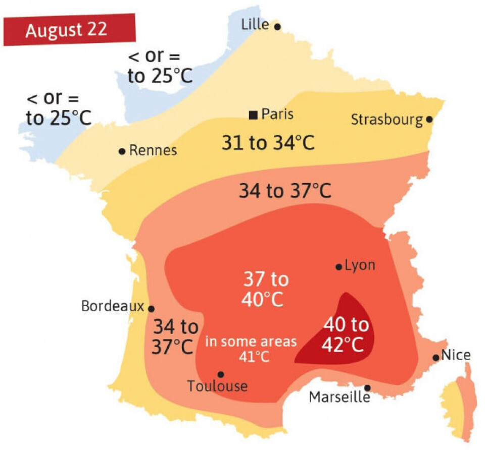

<!-- Image from: "C:\R\Projects\friendly.github.io\blog\drafts\BeachScience\images\thermometer-readouts.webp" -->

Standing at the water's edge this morning, I described the Mediterranean air to my companion as "brisk". She called it "refreshing". A man walking past, perhaps from somewhere much colder, called it "mild". We were all describing the same air at the same moment.

We all go for a plunge
in the clear blue waters. Comparing our impressions, I call it "chilly"; my companion says,
"cool, and refreshing"; the stranger calls it "temperate". Again: same water but different
words to describe what we feel.


This is not a failure of communication, or something you can just dismiss as "individual differences."
It is a BS research question.


## 🌡️ The Meterologist's View

A meteorologist, coming from physical science, explains [What is ‘feels-like’ temperature?](https://www.popsci.com/environment/what-is-feels-like-temperature/)
in terms of [wind-chill](https://en.wikipedia.org/wiki/Wind_chill). This idea
even gets a measure, the **wind-chill factor** (or "feels like" temperature). It is
defined in words as:

> the apparent temperature felt on exposed skin caused by the combination of air temperature and wind speed. Wind strips away your body's natural insulating layer of warm air, making the temperature feel significantly colder than the thermometer reads.

{style="float:right; margin-left:1.5em; margin-bottom:1em; width:45%"}

But that's quite a physical mouthful. There are formulas for this, but
you can understand the physics more easily from a [**heatmap**](https://en.wikipedia.org/wiki/Heat_map) visualization that simply uses background color for the "feels-like" value. Rick Wiklin, a long time friend, explains
how to create [The wind chill chart](https://blogs.sas.com/content/iml/2021/02/24/wind-chill-chart.html) using SAS,
giving the figure at the right.

---

## 💬 What About the Words?

But even if you understand the physics, how can you understand the **words** you use to describe
your feeling of warmth when you are sitting on the beach, or decide to go for a swim?
Perception goes beyond the physics. And there is also something interesting about the way we
use discrete, qualitative words to describe what is a quantitative phenomenon.


## 🎲 The Probability Analogy


In the 1960s, a CIA analyst named [Sherman Kent](https://en.wikipedia.org/wiki/Sherman_Kent) noticed that intelligence reports were full of words like "probable", "unlikely", "almost certain"--- but not everyone agreed on what they meant. He asked a group of NATO officers to assign numerical probabilities to phrases like "serious possibility" and "little chance." The results were alarming. "Probable" mapped to anywhere from 55% to 90% depending on who you asked. Words that felt precise were carrying enormous hidden uncertainty. Not very good when you're
thinking about which foreign interests to support or the likelihood of effecting regime change,


The same problem almost certainly applies to **temperature language**. When your weather app says "warm", when a friend describes the sea as "chilly", when a wine menu mentions serving at "room temperature"---these words are doing quantitative work while pretending to be qualitative. They certainly are _ordered categories_, but nobody has agreed on the numbers.


Beach Science would like to fix this.

Let's look at the methods used to understand words for probability as a model, first proposed
in a [Reddit post by zonination](https://github.com/zonination/perceptions/blob/master/README.md), and using a [ridgeline plot](https://wilkelab.org/ggridges/) to show the distribution of the numerical values that a sample of respondents assigned to a wide range of words used to describe probability.[^joyplot]

[^joyplot]: The original name for this collection of density plots was "joy plot", which
came from the cover image of a music album by the group Joy Division...
`joyplot` package (Claus Wilke).


```{r}
#| label: setupg
#| echo: false
library(tidyverse)
library(ggridges)

probly <- read_csv("https://raw.githubusercontent.com/zonination/perceptions/master/probly.csv")
# probly <- read_csv("probly.csv")  # local cache, if offline

prob_long <- probly |>
  pivot_longer(everything(), names_to = "term", values_to = "probability") |>
  filter(!is.na(probability)) |>
  group_by(term) |>
  mutate(med = median(probability)) |>
  ungroup() |>
  mutate(term = fct_reorder(term, med))

term_summary <- prob_long |>
  distinct(term, med)
```

```{r}
#| label: fig-probwords
#| fig-cap: "Perceived probability of probability words (n ≈ 46). White dot = median. Data: [Zonination](https://github.com/zonination/perceptions)."
#| fig-width: 9
#| fig-height: 9
ggplot(prob_long, aes(x = probability, y = term, fill = med)) +
  geom_density_ridges(scale = 1.8, rel_min_height = 0.01,
                      colour = "grey30", linewidth = 0.4, alpha = 0.85) +
  geom_point(data = term_summary,
             aes(x = med, y = term),
             shape = 21, colour = "black", fill = "white",
             size = 2.6, stroke = 0.6, inherit.aes = FALSE) +
  scale_fill_gradient2(low = "#2166ac", mid = "#d9d0d0", high = "#d6604d",
                       midpoint = 50, name = "Median\n(%)") +
  scale_x_continuous(breaks = seq(0, 100, 10),
                     labels = function(x) paste0(x, "%"),
                     limits = c(0, 100)) +
  labs(title = 'How likely is "likely"?',
       subtitle = "Perceived probability of estimative words (n ≈ 46)\nWhite dot = median",
       x = "Assigned probability (%)", y = NULL,
       caption = "Data: Zonination · github.com/zonination/perceptions") +
  theme_ridges(grid = TRUE, center_axis_labels = TRUE) +
  theme(plot.title = element_text(face = "bold", size = 16),
        legend.position = "none")
```

<!-- Can I connect the medians with a line?
What about a raincloud version to show the data points?
-->

The medians tell us the typical value assigned to the probability words and their relative spacing-- fairly steady trend from "almost no chance" to "probably not", but there is little
difference between "little chance" and "improbable", which surprised me.
Similarly, "likely", "probable", and "we believe" are all the same, a comfort to CIA analysts.

However, the shapes of these distributions tell a more interesting story.
Because probability is bounded in (0, 100), as we approach 0 ("almost no chance") the distributions become more and more positively skewed. We see a similar trend toward right
skewness as probability increases toward 100.

Also notice those small blips in the tails of terms like "almost no chance", "highly unlikely", "highly likely". These seem almost certain outliers, most likely errors in the response or understanding the question. That is why I used the median to mark the center of each distribution.

---


## 📖 A Lexicon of Warmth


{style="float:right; margin-left:1.5em; margin-bottom:1em; width:45%"}
Here, roughly ordered from coldest to hottest, are a modest selection of terms worth studying:


* The **cold** end: Freezing. Frigid. Icy. Bitter. Raw. Chilly. Cool. Fresh. Crisp.


* The **middle**: Mild. Comfortable. Pleasant. Temperate. Neutral. Lukewarm. Tepid.


* The **warm** end: Warm. Balmy. Sultry. Toasty. Hot. Sweltering. Scorching. Blistering. Broiling.


### The Slippery Ones:

- "Brisk"---means cold, but often said cheerfully, to imply you don't mind.

- "Refreshing"---means cold, said approvingly, usually while entering water you were dreading.

- "Perfect beach weather"---means something different to everyone who says it.

- "Room temperature"---nominally 20°C, actually whatever the room happens to be or where you keep your thermostat set.

- "A bit nippy"---British for genuinely cold, deployed as understatement.


This last category is the most interesting. These terms carry _emotional_ valence as well as _thermal content_--- they tell you not just how warm something is, but how the speaker **feels** about it. Separating those two things is itself a research problem.


---


## 📏 What to Measure?


A proper BS study would present subjects with this list of terms---perhaps 25–30 in total---and ask them to assign a temperature in degrees Celsius to each one. Not a range. A number. The discomfort of that precision is part of the point.


From a reasonable sample you'd get, for each term:

- A mean/median "consensual temperature"
- A standard deviation or median absolute difference (MAD)---how much people disagree on average
- The shapes of the distributions would also be revealing: Possibly a bimodal distribution for the slippery ones; e.g., "refreshing" might split between people who love cold water and people who merely tolerate it.


You'd also want to ask about or design for **context** of the judgement.
"Warm" for bathwater, air temperature, and sea temperature are probably calibrated mentally quite differently. "Lukewarm" for coffee is not the same as "lukewarm" for political support---though it would be amusing to find out if they're numerically similar.
This last example points to the metaphorical uses of terms for "warmth."


### Individual Differences


The Kent study found systematic differences by nationality and professional background. You'd expect the same here, and more:

- Geographic origin---someone from Helsinki and someone from Lagos will likely not agree on "mild"
- Age---thermoregulation changes with age; older people tend to run cooler
- Sex---well documented differences in thermal comfort (REF??), still not fully explored or explained
- Recent acclimatisation---what felt "cold" on day one of a beach holiday feels merely "brisk" by day five


This suggests the study needs demographic covariates, and that the interesting finding might not be the mean temperatures but the variability---which terms are universally agreed upon, and which are doing completely different work for different people.


My prediction: freezing and scorching will have the tightest agreement. Mild, comfortable, and fresh will be all over the place.


### How to Study It


An online survey would work fine---present the terms in randomised order, ask for a numeric temperature response, collect demographics. A hundred respondents would give you something interesting; 200--300 would give you something publishable.


The analysis is straightforward: descriptive statistics for each term, then a plot showing the distribution of responses---a ridgeline plot or violin plot would show both the central tendency and the spread beautifully. Terms ordered by median temperature on the y-axis; spread showing disagreement. You'd see immediately which words are doing precise work and which are vessels into which people pour their own thermal experience.


In the main study, the context context would be that of a day at the beach, because, after all this is Beach Science.
A follow-up study worth also doing: present the same terms with varied context (the sea was "refreshing", the coffee was "lukewarm", a "mild" day for January) and see how much context shifts the numbers. My guess: substantially.

---

Before we leave temperature behind, let's go back to that wind chill heat map from a few sections ago. There are three things worth knowing about it that have nothing to do with thermoregulation and everything to do with how we ended up making heat maps look the way they do.

## 🗺️ Where the Heat in "Heat Map" Came From

The wind chill grid shown above is, technically, a heat map---though nothing about it is hot, which is the first small joke buried in the term; neither is it a map. "Heat map" as a word didn't exist until the 1990s, coined by a software designer named [Cormac Kinney](https://en.wikipedia.org/wiki/Cormac_Kinney) to describe color-coded grids of financial trading data. Red for losses, green for gains, no actual thermodynamics involved.

{style="float:right; margin-left:1.5em; margin-bottom:1em; width:45%"}

But the *idea*---take a continuous quantity, drape it over a grid or a map, and let color do the talking instead of numbers---is much older, and it is, satisfyingly, French. In 1826, a civil engineer named Charles Dupin produced a map of France shaded by region according to literacy rates: dark for the illiterate departments, light for the educated ones. It is widely credited as the first true choropleth map, the direct ancestor of every heat map since. Dupin wasn't measuring temperature either. He was measuring ignorance, and he made it visible by treating data the way a thermometer treats a fever---as something you could read off a surface at a glance.

The French called this kind of cartography *carte teintée*---tinted map---and by the 1870s and 80s it had become a national obsession, particularly among the statisticians whose successors I claim, somewhat shamelessly, as ancestors of this blog. André-Michel Guerry shaded France by crime rates. Adolph d'Angeville (1836) and
Émile Cheysson shaded it by nearly everything else. None of them used the word "heat," but all of them had discovered the same trick Kinney would rediscover a century later in a Wall Street office: color is faster than numbers, and a grid is just a map that gave up on geography.

So when you look at the wind chill heat map above, you are looking, distantly, at a French literacy census from the age of steam trains---translated, by way of finance, into windburn.

---

## 🎨 The Colormap Wars

Choosing the colors for a heat map sounds like the easy part. It is not. It is, in fact, one of the more reliably bitter disputes in cartography and geo-science, and the wind chill grid above was a small battlefield of its own before Rick Wicklin picked a palette.
He used a [color gradient](https://github.com/sascommunities/the-do-loop-blog/blob/master/wind-chill/windchill.sas) going from dark purple through dark cyan to light orange, with a
light grey in the middle.

For decades the default choice was the rainbow---blue through green, yellow, orange, red---sometimes called "jet," after the MATLAB colormap of the same name. It looks dramatic. It is also, perceptually, a disaster. The human eye does not register the jump from green to yellow the same way it registers the jump from blue to green; the rainbow has uneven "speed," which means a smooth underlying gradient in your data can appear to have bands, ridges, and false boundaries that exist only in the colormap, not in the world. Cardiologists reading rainbow-colored heart scans have missed real anomalies and flagged fake ones for exactly this reason. People have written grievance-length papers about it.

The reform movement---viridis, magma, and their relatives, developed for Python's matplotlib and now ported everywhere including R---fixes this by being perceptually uniform: equal steps in the data are supposed to produce equal-looking steps in color, in both color and grayscale, even for colorblind readers. The aesthetic cost is that viridis is, frankly, a little dour. Purple to teal to yellow-green. Nobody has ever called it dramatic. The color gamut often leaves most
of the graphic purple.

Here are all four together, courtesy of the **colorspace** package's `swatchplot()`:

```{r}
#| label: fig-colormaps
#| fig-cap: "Four colormaps compared: the perceptually uneven 'jet' rainbow, R's classic heat.colors, and the perceptually uniform viridis and magma."
#| fig-width: 7
#| fig-height: 3.5
library(colorspace)

n <- 256
jet     <- colorRampPalette(c("#00007F", "blue", "#007FFF", "cyan",
                               "#7FFF7F", "yellow", "#FF7F00", "red", "#7F0000"))(n)
heat    <- heat.colors(n)
viridis <- hcl.colors(n, "Viridis")
magma   <- viridisLite::magma(n)

swatchplot(
  jet     = jet,
  heat    = heat,
  viridis = viridis,
  magma   = magma
)
```

Look closely at the jet bar: the eye snags on the blue-to-cyan and yellow-to-orange transitions, while green-to-yellow slides by almost unnoticed---the "uneven speed" the rainbow critics complain about, visible without a single data point attached to it. Viridis and magma, by contrast, change at a steady visual pace from one end to the other.

Wind chill complicates things further because it's a *diverging* quantity---there's a meaningful zero, comfort on one side, discomfort on the other---which opens an entirely separate argument about whether the midpoint should be white, gray, or invisible, and whether red-for-cold or blue-for-cold is the more honest cruelty. I went with blue-to-red, anchored at freezing, mostly because anything else felt like editorializing about a topic the body has already settled on its own.

<!--
What is your favourite "ColorGradient" to plot heatmap or surfaces for publications? : r/Julia
https://www.reddit.com/r/Julia/comments/p3j4uu/what_is_your_favourite_colorgradient_to_plot/

Heatmap colors: ggplot
https://share.google/dAT4VeB75qY3jfwYf
-->

---

## 💻 Telling a Computer What Color You Mean

Underneath any heat map is a more basic problem: how do you even tell a computer "make this slightly less alarming shade of orange"? There turn out to be several competing dialects for this, and they disagree less about color than about what a human actually cares about when picking one.

Hex codes---#FF7F50, say---are the lingua franca and also faintly hostile. Six digits of base-16, no relation to anything you'd say out loud. You don't *pick* a hex code so much as submit to one that someone else already found. You can make colors transparent by adding two more hex
digits for an "alpha" channel.

> Every time I type a hex code, somewhere a crayon box weeps quietly.

<!-- Alternate: Every time I code a color in hex, a tiny part of my soul converts to base-16. -->

RGB is the same idea in friendlier units: how much red, green, and blue light to fire. It's honest about how screens work, which is also its flaw---it describes the machine, not the color as you experience it. Turning a color "a bit lighter" in RGB means tweaking three numbers at once, none of which is labeled "lighter."

HSL was built to fix that---hue, saturation, *lightness*---and for years was the standard answer to "I just want to slide one knob and make it pale." The trouble is its lightness knob lies. Pure yellow and pure blue can claim the same HSL lightness value while looking nothing alike in actual brightness to a human eye. The L doesn't track perception; it tracks a formula that resembles perception in some lighting and abandons it in others.

OKLCH is the newer fix, built specifically so its lightness axis matches what a person would actually call lighter or darker, hue by hue, consistently. For a diverging scale like wind chill, where the whole point is a smooth, trustworthy gradient from danger to comfort, that's not a cosmetic upgrade---it's the difference between a gradient that reads as one continuous fact and one that quietly fibs in the yellows. Lightness, it turns out, is the one knob worth getting right; everything else is decoration.

---

## 🔗 Further Reading

**Kinney and the heat map**

- Wikipedia, ["Heat map"](https://en.wikipedia.org/wiki/Heat_map) --- coinage, 1991 trademark, history of shaded matrices back to Toussaint Loua (1873)
- Wikipedia, ["Cormac Kinney"](https://en.wikipedia.org/wiki/Cormac_Kinney) --- NeoVision Hypersystems, the Citibank application, trademark lapse

**Dupin and the choropleth**

- Wikipedia, ["Charles Dupin"](https://en.wikipedia.org/wiki/Charles_Dupin)
- Wikipedia, ["Choropleth map"](https://en.wikipedia.org/wiki/Choropleth_map) --- 1826 *Carte figurative de l'instruction populaire de la France*, the *carte teintée* tradition that followed
- History of Information, ["The First Choroplethic Map"](https://historyofinformation.com/detail.php?id=4632)

**Guerry**

- Wikipedia, ["André-Michel Guerry"](https://en.wikipedia.org/wiki/André-Michel_Guerry)
- Friendly, M. (2007), ["A.-M. Guerry's Moral Statistics of France: Challenges for Multivariable Spatial Analysis,"](https://www.datavis.ca/papers/guerry-STS241.pdf) *Statistical Science*
- Friendly, M. (2022), ["The Life and Works of André-Michel Guerry, Revisited,"](https://www.datavis.ca/papers/guerryvie/GuerryLife2-SocSpectrum.pdf) *Sociological Spectrum*

**Color maps**

[What is your favourite "ColorGradient" to plot heatmap or surfaces for publications?](https://www.reddit.com/r/Julia/comments/p3j4uu/what_is_your_favourite_colorgradient_to_plot/)


**OKLCH**

- Wikipedia, ["Oklab color space"](https://en.wikipedia.org/wiki/Oklab_color_space) --- Björn Ottosson's 2020 derivation
- Evil Martians, ["OKLCH in CSS: why we moved from RGB and HSL"](https://evilmartians.com/chronicles/oklch-in-css-why-quit-rgb-hsl) --- the clearest plain-language explainer of L, C, H and why the old lightness knobs lie
- W3C, [CSS Color Module Level 4](https://www.w3.org/TR/css-color-4/) --- the spec itself, oklch() section

<!--
---

*Postscript:* I asked my companion what temperature she'd assign to "warm." She said 22°C. I said 27°C. We have been on this beach for four days. We are, apparently, still not calibrated to the same scale.

-->
