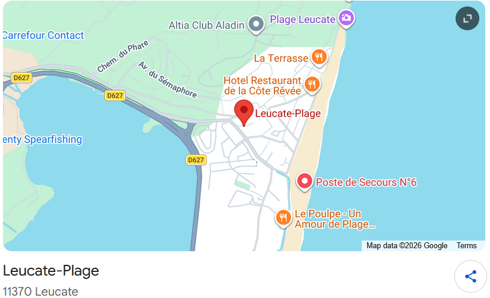

{style="float:right; margin-left:1.5em; margin-bottom:1em; width:45%"}
*Dateline*: [Leucate Plage](https://www.tourisme-leucate.com/decouvrir/leucate-en-mediterranee/leucate-5-entites/leucate-plage/), along the route between Perpignan and Narbonne, backed by a parasailing cliff, with the Pyrenees and the my beloved [Canigó](https://en.wikipedia.org/wiki/Canig%C3%B3) floating on the horizon.

I am lying on my beach towel. Eyes closed, feeling the warmth of the sun. My mind is drifting, as it often does
in this pleasurable horizontal position. One day, I had the idea that this could be a surprisingly productive scientific posture.

The beach, if you allow it, has a way of stripping away the usual noise and leaving you with the elemental: sun, sand, water, wind, and a parade of fellow humans in various states of dress.  And if your mind is the kind that cannot quite switch off--- if "relaxing" means your thoughts wander toward interesting questions rather than away from them--- the beach turns out to be a remarkably fertile environment for scientific thought.

With this post, I am hereby founding the new discipline of  **Beach Science** (BS).
If someone has done this before, I apologize for the overlap. If not, I'll consider applications for graduate students who want to get in on this sand-breaking work.

## What is Beach Science?

Beach Science is the practice of lying on a beach towel, eyes closed, and allowing interesting scientific questions to bubble up from the environment around you. No lab or
lab coat required. No grant proposal to write. Just sun, curiosity, and a willingness to call horizontal contemplation "fieldwork," or "beach brainstorming."

The questions it can generate are real questions--- ones that can touch on physics, psychology, statistics, genetics, social science or anything that piques your interest. They just happen to be inspired by the beach rather than a seminar room. Isn't that a great improvement?

## A taste of what's coming

I started making notes on this topic last year.
Here are a few things that appeared in my consciousness while drifting.
Where applicable, I might simulate some data and make some graphs, but that work is done after a nice day on Leucate Plage.

⛅ **Clouds and Warmth**: Lying here, I notice a striking change in comfort every time a cloud drifts across the sun. My weather app says 24°C. My skin disagrees. What, exactly, is the relationship between cloud cover and perceived warmth? How would you study it? (Spoiler: it involves pyranometers, mixed-effects models, and willing volunteers bribed with sunscreen.)

🏖️ **Beach gear and Personality.** Some people arrive with a towel. Others roll in with wheeled carts, pop-up tents, inflatable everything, and what appears to be a portable kitchen. Is this random variation, or can the [Big Five](https://en.wikipedia.org/wiki/Big_Five_personality_traits) personality inventory predict your Beach Gear Index? I suspect it can.

🌊 **Dimensions of Beachiphilia**: How many ways do you love or not love the beach? Some people plunk themselves down and read a book, while others toss a frisbee or play paddle tennis. Still others are glued to their phones or sit around and chat. If you recorded their responses to a questionnaire rating likes and dislikes about the beach, how many dimensions would you expect to find?

These are the kinds of questions Beach Science asks. Rigorous enough to take seriously. Ridiculous enough to enjoy.

More dispatches from the towel will follow. The next post in this series will suggest some warm-up exercises you can do to become your own beach scientist.
