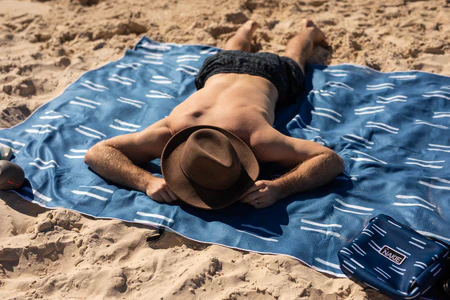

<!-- {style="float:right; margin-left:1.5em; margin-bottom:1em; width:45%"} -->
<iframe width="425" height="350" src="https://www.openstreetmap.org/export/embed.html?bbox=3.02699089050293%2C42.889926775096285%2C3.0671596527099614%2C42.911932574385105&amp;layer=mapnik" style="float:right; margin-left:1.5em; margin-bottom:1em; border: 1px solid black"></iframe>
*Dateline*: [Leucate Plage](https://www.tourisme-leucate.com/decouvrir/leucate-en-mediterranee/leucate-5-entites/leucate-plage/), along the route between Perpignan and Narbonne, backed by a parasailing cliff, with the Pyrenees and the my beloved [Canigó](https://en.wikipedia.org/wiki/Canig%C3%B3) floating on the horizon.

I am lying on my beach towel. Eyes closed, feeling the warmth of the sun. My mind is drifting, as it often does
in this pleasurable horizontal position. One day, I had the idea that this could be a surprisingly productive scientific posture.

The beach, if you allow it, has a way of stripping away the usual noise and leaving you with the elemental: sun, sand, water, wind, and a parade of fellow humans in various states of dress.  And if your mind is the kind that cannot quite switch off--- if "relaxing" means your thoughts wander toward interesting questions rather than away from them--- the beach turns out to be a remarkably fertile environment for scientific thought.

With this post, I am hereby founding the new discipline of  **Beach Science** (BS).
If someone has done this before, I apologize for the overlap. If not, I'll consider applications for graduate students who want to get in on this sand-breaking work.

## 🏖️ What is Beach Science?

{style="float:right; margin-left:1.5em; margin-bottom:1em; width:45%"}
Beach Science is the practice of lying on a beach towel, eyes closed, and allowing interesting scientific questions to bubble up from the environment around you. No lab or
lab coat required. No grant proposal to write. Just sun, curiosity, and a willingness to call horizontal contemplation "fieldwork," or "beach brainstorming."

The questions it can generate are real questions--- ones that can touch on physics, psychology, statistics, genetics, social science or anything that piques your interest. They just happen to be inspired by the beach rather than a seminar room. Isn't that a great improvement?

Carl Sagan once observed that every child starts out as a natural-born scientist, and then we beat it out of them.[^Sagan] A few make it through with their wonder intact. He credited his own survival to parents who, knowing nothing about science, encouraged it anyway. The rest of us have to find our way back--- and it turns out the beach is a surprisingly good place to start. No equipment required. No prior experience necessary. Just lie down and pay attention.

The Nobel laureate Richard Feynman, one of the most original minds of the 20th century, captures the spirit of Beach Science in these
memorable quotes,

> “Study hard what interests you the most in the most undisciplined, irreverent and original manner possible.”[^Feynman1]

> “Fall in love with some activity, and do it! Nobody ever figures out what life is all about, and it doesn’t matter. Explore the world. Nearly everything is really interesting if you go into it deeply enough.”[^Feynman2]

[^Sagan]: Carl Sagan, _Psychology Today_, January 1996
[^Feynman1]: Richard P. Feynman, letter to J.M. Szabados, November 1965. Published in _Perfectly Reasonable Deviations from the Beaten Track: The Letters of Richard P. Feynman_ (2008).
[^Feynman2]: Richard P. Feynman, _The Meaning of It All: Thoughts of a Citizen-Scientist_ (1998), based on his 1963 public lectures.

## 🔬 The Methods of Beach Science

> "It is by logic that we prove, but by intuition that we discover."
> --- Henri Poincaré, *Science and Method* (1908)

The posts in this series begin not with hypotheses but with *noticing* --- a shadow, a sound, a discomfort, a question that arrives unbidden while doing nothing useful. The logic, the data, the models come afterward, in service of what curiosity already suspected.

This is, of course, part of an older contrast:

- Aristotle vs. Plato
- bottom-up (observation-driven) vs. top-down (theory-driven)
- Tukey's exploratory data analysis vs. confirmatory, hypothesis-testing methods
- the naturalist's notebook vs. the laboratory

The beach is an especially good place for Aristotle. You can't bring much apparatus to the shore, but you can pay attention and develop intuitions.
That said, once a question is in hand, there are two ways to proceed --- and it's worth being explicit about which one I'm doing.

**Exploratory BS** follows the spirit of the enterprise: an observation, a half-formed hunch, a question that floats to the surface while you're counting your breaths. You follow the thread, see where it leads, build a little mental model. Only afterward do you go looking to see what others have done --- with a certain measure of delight (or chagrin) at discovering how your intuitions hold up.

**Confirmatory BS** works in the opposite direction. You begin with a topic and ask: what theoretical framework exists? How have others conceptualized this, collected data, tested hypotheses? Then you can bring that structure to bear on whatever the beach throws at you.

In practice, most posts here follow the EBS → CBS path. This has a pleasing consequence: when I finally consult the literature, I get to ask --- are my beach-towel intuitions on-target? Totally naïve? Perhaps occasionally novel? Not all BS ideas pan out. But the ones that do work out feel like they've earned it. And if they don't, perhaps I've learned something from the attempt.

> "What we observe is not nature itself, but nature exposed to our method of questioning."
> --- Werner Heisenberg, *Physics and Philosophy* (1958)

## 🌅 A taste of what's coming

I started making notes on this topic last year.
Here are a few things that appeared in my consciousness while drifting.
Where applicable, I might simulate some data and make some graphs, but that work is done after a nice day on Leucate Plage. 

⛅ **Clouds and Warmth**: Lying here, I notice a striking change in comfort every time a cloud drifts across the sun. My weather app says 24°C. My skin disagrees. What, exactly, is the relationship between cloud cover and perceived warmth? How would you study it? (Spoiler: it involves pyranometers, mixed-effects models, and willing volunteers bribed with sunscreen.)

🏖️ **Beach gear and Personality.** Some people arrive with a towel. Others roll in with wheeled carts, pop-up tents, inflatable everything, and what appears to be a portable kitchen. Is this random variation, or can the [Big Five](https://en.wikipedia.org/wiki/Big_Five_personality_traits) personality inventory predict your Beach Gear Index? I suspect it can.

🌊 **Dimensions of Beachiphilia**: How many ways do you love or not love the beach? Some people plunk themselves down and read a book, while others toss a frisbee or play paddle tennis. Still others are glued to their phones reading [BlueSky posts](https://bsky.app/) or sit around and chat. If you recorded their responses to a questionnaire rating likes and dislikes about the beach, how many dimensions would you expect to find?

These are the kinds of questions Beach Science asks. Rigorous enough to take seriously. Ridiculous enough to enjoy.

## 📋 Posts in This Series

Unlike most other blog series, the posts here are allowed to be dynamic, rather than static. 
I may publish something, and then revise it later as some new idea or perspective arises from the beach.

- [Warm-Up Exercises for the Beach Scientist](../2026-06-beach-science-warmup/)
- [How Warm Is "Warm"?](../2026-06-beach-science-howwarm/)
- [Are You a Beach Person or a Pool Person?](../2026-06-beach-science-beachpeople/)
- [The Aerodynamics of Not Losing Your Umbrella](../2026-06-beach-science-umbrella/)
- [Beach Patterns as a Physics Laboratory](../2026-06-beach-science-patterns/)
