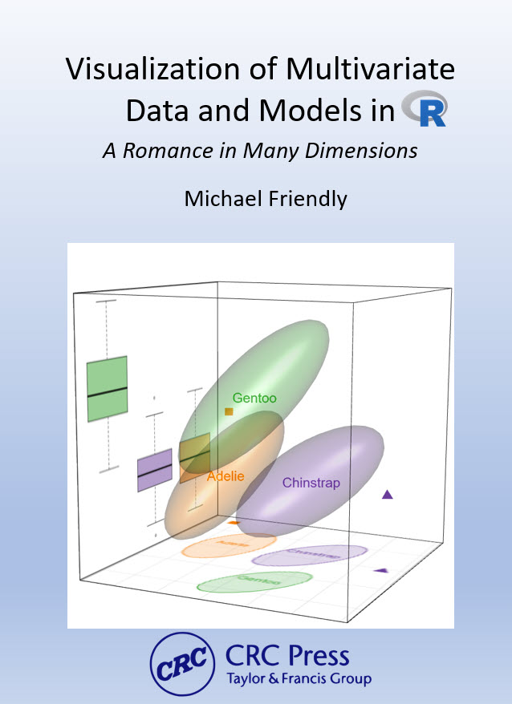
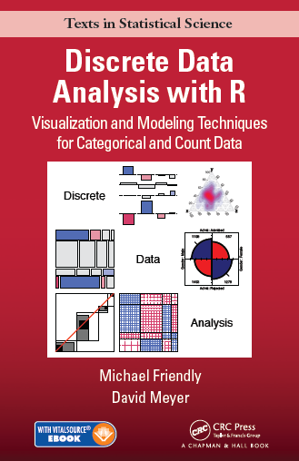

::: {.column-page}

I have authored and co-authored several books on data visualization and statistical methods in R. These books emphasize graphical understanding of statistical concepts and practical implementation.

::: {.grid}

::: {.g-col-12 .g-col-md-6}
::: {.card .h-100}
::: {.card-body}

::: {.book-card-content}

### Visualizing Multivariate Data and Models in R

A comprehensive guide to understanding multivariate linear models through visualization. Covers HE plots, canonical discriminant analysis, and other graphical methods for multivariate data.

**Status**: Under review. To be published by CRC Press, 2026. Available online

[Read online →](https://friendly.github.io/Vis-MLM-book/){.btn .btn-primary}

:::

:::
:::
:::

::: {.g-col-12 .g-col-md-6}
::: {.card .h-100}
::: {.card-body}

::: {.book-card-content}

### Discrete Data Analysis with R

Co-authored with David Meyer, this book provides an accessible introduction to the major methods of categorical data analysis for data exploration, statistical testing and visualization. As opposed to more theoretical books, the goal here is to help the reader to translate theory into practical application, by providing skills and software tools for carrying out these methods. 

**Publication information**: Michael Friendly and David Meyer, [Discrete Data Analysis with R: Visualization and Modeling Techniques for Categorical and Count Data]( https://www.crcpress.com/9781498725835 ), 2016, Chapman and Hall/CRC, ISBN 9781498725835.

[Book website →](http://ddar.datavis.ca/pages/home){.btn .btn-primary}

:::

:::
:::
:::

:::

## Additional Resources

For more information about my books and related materials, visit my [books page at datavis.ca](https://www.datavis.ca/books/).

:::
