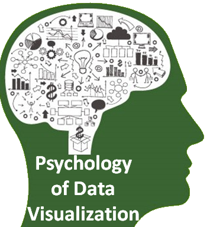
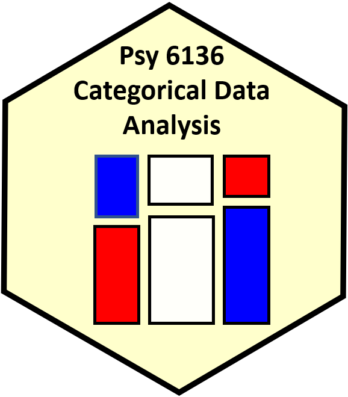

::: {.column-page}

I teach graduate courses in psychology and statistics at York University, with extensive online materials available for each course.

## Current Courses

::: {.card .course-card}
::: {.card-body}

::: {.course-card-content}

### PSY 6135: Psychology of Data Visualization

A graduate seminar exploring the cognitive and perceptual foundations of data visualization. Covers principles of graphical perception, design of effective visualizations, and the history of statistical graphics.

**Course materials available online** with lecture notes, assignments, and examples.

[Course website →](https://friendly.github.io/6135/){.btn .btn-primary}

:::

:::
:::

::: {.card .course-card}
::: {.card-body}

::: {.course-card-content}

### PSY 6136: Categorical Data Analysis

A graduate course on methods for analyzing categorical and discrete data. Topics include loglinear models, logistic regression, generalized linear models, and visualization methods for categorical data.

**Comprehensive online resources** including R code, datasets, and tutorials.

[Course website →](https://friendly.github.io/psy6136/){.btn .btn-primary}

:::

:::
:::

## Older Courses

::: {.card .course-card}
::: {.card-body}

::: {.course-card-content}

### PSY 6140: Multivariate Data Analysis

Psychology 6140 is designed to provide an integrated, in depth, but applied approach to multivariate data analysis and linear statistical models in behavioural science research. There is a strong emphasis on using graphical methods to understand your data.

**Statistical topics covered include:**
Regression analysis,
Univariate and multivariate ANOVA and ANCOVA,
Discriminant analysis,
Logistic regression,
Canonical correlation analysis,
Principal components, factor analysis, LISREL models (CFA, SEMs),
Cluster analysis and Multidimensional Scaling

[Course website →](http://friendly.apps01.yorku.ca/psy6140/){.btn .btn-primary}

:::

:::
:::

## Short Courses & Workshops

I regularly teach short courses and workshops on:

- Data visualization in R
- Multivariate linear models
- Categorical data analysis
- Historical perspectives on statistical graphics

For more information about courses and teaching materials, visit my [courses page at datavis.ca](https://www.datavis.ca/courses/).

:::
