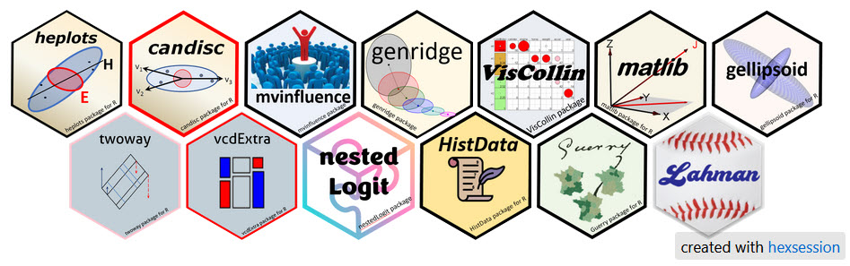

::: {.column-page}

## About me

::: {.profile-section}

I'm a Professor of Psychology at York University, specializing in **data visualization** and **statistical methods**. My research focuses on development of graphical methods for understanding multivariate data and models and visualization for categorical data. Another passion is the study of the history of data visualization, captured in my [Milestones Project](http://datavis.ca/milestones/) and historical [research papers](https://www.datavis.ca/papers/#history).

:::

## Highlights

::: {.grid}

::: {.g-col-12 .g-col-md-6}
### R Packages
I maintain over 15 R packages for multivariate analysis, categorical data analysis, and historical datasets. These packages emphasize visualization and understanding of statistical methods.

[Explore packages →](packages.qmd){.btn .btn-primary}
:::

::: {.g-col-12 .g-col-md-6}
### Books
Author of several books on data visualization and statistical methods in R, including works on visualizing multivariate models and discrete data analysis.

[View books →](books.qmd){.btn .btn-primary}
:::

::: {.g-col-12 .g-col-md-6}
### Courses
Teaching materials for graduate courses in Psychology of Data Visualization and Categorical Data Analysis, with extensive online resources.

[See courses →](courses.qmd){.btn .btn-primary}
:::

::: {.g-col-12 .g-col-md-6}
### Software
Extensive collection of SAS macros for statistical graphics and analysis, developed over many years and freely available on GitHub.

[Browse software →](software.qmd){.btn .btn-primary}
:::

:::

## Recent Work

My current work emphasizes the use of visualization to understand statistical models and data structure, with particular focus on:

- HE plots for multivariate linear models
- Visualization of categorical data analysis
- Historical datasets in statistics
- Teaching statistical graphics

## Contact & Links

- **Website**: [datavis.ca](https://datavis.ca/)
- **GitHub**: [github.com/friendly](https://github.com/friendly)
- **BlueSky**: [https://bsky.app/profile/datavisfriendly.bsky.social](https://bsky.app/profile/datavisfriendly.bsky.social)
- **Email**: friendly AT yorku DOT ca

:::
