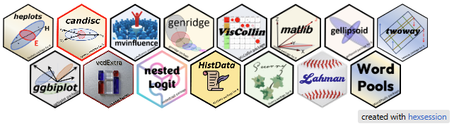

::: {.column-page}

<!-- Static fallback image, superseded by the live interactive hex tile below.

-->

<!-- Live interactive hex tile via hexsession::make_tile(). -->
```{r}
#| echo: false
#| message: false
#| results: asis

library(hexsession)

# "twoway" omitted: its installed package has no man/figures/logo.png,
# so hexsession can't auto-discover a logo for it (prompts interactively). [FIXED]
pkgs <- c("heplots", "candisc", "mvinfluence", "genridge", "VisCollin",
          "matlib", "gellipsoid", "twoway", "ggbiplot", "vcdExtra", "nestedLogit",
          "HistData", "Guerry", "Lahman", "WordPools")

# Some packages ship multiple logo-like images (e.g. logo.png + logo-old.png),
# which makes hexsession's auto-picker prompt interactively. Resolve those
# ourselves -- preferring a file literally named `"logo.png"` -- so make_tile()
# never needs to ask.
resolve_logo <- function(pkg) {
  files <- list.files(system.file(package = pkg),
                       pattern = "\\.png$|\\.jpg$|\\.svg$",
                       recursive = TRUE, full.names = TRUE)
  matches <- files[grepl("hex|logo", files, ignore.case = TRUE)]
  if (length(matches) == 0) return(NA_character_)
  preferred <- matches[basename(matches) == "logo.png"]
  if (length(preferred) >= 1) preferred[1] else matches[1]
}

logos <- vapply(pkgs, resolve_logo, character(1))
urls <- vapply(pkgs, function(p) {
  url <- packageDescription(p)$URL
  if (is.null(url)) paste0("https://cran.r-project.org/package=", p) else strsplit(url, ",")[[1]][1]
}, character(1))

# Original approach -- kept for reference. This embeds make_tile()'s HTML
# fragment directly into the page, which caused two display bugs:
# 1. make_tile() emits a self-contained mini-page (own <style>/<script>,
#    including a global `body { background-color; color }` rule for its
#    own baked-in light/dark toggle). Embedded raw, that rule collided
#    with the site's own dark-mode CSS: body background got stuck light,
#    and card description text went white-on-white when the site's dark
#    mode was on.
# 2. The tile grid picked up an unwanted vertical scrollbar/clipped height,
#    from Quarto's `.cell-output-display { overflow-x: auto }` interacting
#    with the widget's absolutely-positioned `.attribution` element.
#
# htmltools::div(
#   style = "max-width: 600px; margin: 20px auto;",
#   make_tile(local_images = logos, local_urls = urls)
# )

# Fix: render make_tile()'s HTML into an <iframe srcdoc>, so its own
# <style>/<script> are scoped to the iframe's document and can't leak into
# (or be affected by) the site's page. The iframe's height isn't known up
# front (it depends on how many packages are tiled), so the iframe posts
# its rendered height back to the parent window via postMessage, and we
# resize the iframe to fit once that message arrives.
widget_html <- as.character(make_tile(local_images = logos, local_urls = urls))

doc <- sprintf('<!DOCTYPE html><html><head><meta charset="utf-8"><style>
html, body { margin: 0; padding: 0; background: transparent !important; }
.main { padding-bottom: 8px; }
.attribution {
  position: static !important;
  display: block;
  text-align: right;
  color: #888 !important;
  background: transparent !important;
}
</style></head><body>%s
<script>
function hexsessionReportHeight() {
  var h = document.documentElement.scrollHeight;
  window.parent.postMessage({ hexsessionHeight: h }, "*");
}
window.addEventListener("load", function() {
  hexsessionReportHeight();
  setTimeout(hexsessionReportHeight, 50);
});
window.addEventListener("resize", hexsessionReportHeight);
</script>
</body></html>', widget_html)

cat(sprintf(
  '<div style="max-width: 600px; margin: 20px auto;">
<iframe id="hexsession-frame" srcdoc="%s" style="width: 100%%; height: 320px; border: none; display: block;" scrolling="no"></iframe>
</div>
<script>
window.addEventListener("message", function(e) {
  if (e.data && typeof e.data.hexsessionHeight === "number") {
    var f = document.getElementById("hexsession-frame");
    if (f) { f.style.height = e.data.hexsessionHeight + "px"; }
  }
});
</script>',
  htmltools::htmlEscape(doc, attribute = TRUE)
))
```

This page provides overview descriptions of my R packages and those I have contributed to. The package logos in the interactive image above 
(courtesy of the [hexsession package](https://cran.r-project.org/package=hexsession)) link to their GitHub repositories. Documentation (**Docs**) in the panel buttons take you to the [pkgdown](https://pkgdown.r-lib.org/) sites with full documentation and rendered vignettes. 

Most of these are also available in daily builds of the latest version from [R-universe](https://friendly.r-universe.dev/builds).

For a complete list of all packages with full descriptions, see the GitHub [packages.md](https://github.com/friendly/friendly/blob/main/packages.md) page in my [GitHub profile](https://github.com/friendly).

```{r}
#| echo: false

# Helper functions to generate card HTML
card <- function(title, text, github_url, doc_url, logo_url) {
  lines <- c(
    '<div class="g-col-12 g-col-md-6 g-col-lg-4">',
    '<div class="card h-100">',
    '<div class="card-body">',
    '<div>',
    paste0('<a href="', github_url, '"></a>'),
    '',
    paste0('<h3><a href="', github_url, '">', title, '</a></h3>'),
    '',
    paste0('<p>', text, '</p>'),
    '',
    paste0('<a href="', doc_url, '" class="btn btn-sm btn-outline-primary">Docs</a>'),
    paste0(' <a href="', github_url, '" class="btn btn-sm btn-outline-primary">Source</a>'),
    '',
    '</div>',
    '</div>',
    '</div>',
    '</div>'
  )
  cat(lines, sep="\n")
}
```

## Multivariate Linear Models {#mlm}

::: {.grid}

```{r}
#| echo: false
#| results: asis

card(
  title = "heplots",
  text = "Provides HE plot and other functions for visualizing hypothesis tests in multivariate linear models. HE plots represent sums-of-squares-and-products matrices for linear hypotheses and for error using ellipses (in two dimensions) and ellipsoids (in three dimensions).",
  github_url = "https://github.com/friendly/heplots",
  doc_url = "http://friendly.github.io/heplots/",
  logo_url = "https://raw.githubusercontent.com/friendly/heplots/master/man/figures/logo.png"
)

card(
  title = "candisc",
  text = "Functions for computing and visualizing generalized canonical discriminant analyses and canonical correlation analysis for a multivariate linear model. The graphic functions provide low-rank (1D, 2D, 3D) visualizations of terms in an 'mlm'.",
  github_url = "https://github.com/friendly/candisc",
  doc_url = "https://friendly.github.io/candisc/",
  logo_url = "https://raw.githubusercontent.com/friendly/candisc/master/man/figures/logo.png"
)

card(
  title = "VisCollin",
  text = "Provides methods to calculate diagnostics for multicollinearity among predictors in a linear or generalized linear model, and methods to visualize those diagnostics including better tabular presentation and a \"collinearity biplot\".",
  github_url = "https://github.com/friendly/VisCollin",
  doc_url = "https://friendly.github.io/VisCollin",
  logo_url = "https://raw.githubusercontent.com/friendly/VisCollin/master/man/figures/logo.png"
)

card(
  title = "genridge",
  text = "Introduces generalizations of the standard univariate ridge trace plot used in ridge regression. These graphical methods show both bias (shrinkage) and precision, by plotting the covariance ellipsoids of the estimated coefficients.",
  github_url = "https://github.com/friendly/genridge",
  doc_url = "https://friendly.github.io/genridge/",
  logo_url = "https://raw.githubusercontent.com/friendly/genridge/master/man/figures/logo.png"
)

card(
  title = "mvinfluence",
  text = "Computes regression deletion diagnostics for multivariate linear models and provides associated diagnostic plots. Measures include hat-values (leverages), generalized Cook's distance, and generalized squared studentized residuals.",
  github_url = "https://github.com/friendly/mvinfluence",
  doc_url = "https://friendly.github.io/mvinfluence/",
  logo_url = "https://raw.githubusercontent.com/friendly/mvinfluence/master/man/figures/logo.png"
)

card(
  title = "matlib",
  text = "A collection of matrix functions for teaching and learning matrix linear algebra as used in multivariate statistical methods. Functions are designed for tutorial purposes with clear demonstrations of algorithms.",
  github_url = "https://github.com/friendly/matlib",
  doc_url = "https://friendly.github.io/matlib/",
  logo_url = "https://raw.githubusercontent.com/friendly/matlib/master/man/figures/logo.png"
)

card(
  title = "ggbiplot",
  text = "A 'ggplot2' based implementation of biplots, giving a representation of a dataset in a two dimensional space accounting for the greatest variance.",
  github_url = "https://github.com/friendly/ggbiplot",
  doc_url = "http://friendly.github.io/ggbiplot/",
  logo_url = "https://raw.githubusercontent.com/friendly/ggbiplot/master/man/figures/logo.png"
)

card(
  title = "gellipsoid",
  text = "Represents generalized geometric ellipsoids with the \"(U,D)\" representation. It allows degenerate and/or unbounded ellipsoids, together with methods for linear and duality transformations.",
  github_url = "https://github.com/friendly/gellipsoid",
  doc_url = "https://friendly.github.io/gellipsoid/",
  logo_url = "https://raw.githubusercontent.com/friendly/gellipsoid/master/man/figures/logo.png"
)

card(
  title = "twoway",
  text = "Carries out analyses of two-way tables with one observation per cell, together with graphical displays for an additive fit and a diagnostic plot for removable 'non-additivity'.",
  github_url = "https://github.com/friendly/twoway",
  doc_url = "https://friendly.github.io/twoway",
  logo_url = "https://raw.githubusercontent.com/friendly/twoway/master/logo.png"
)
```

:::

## Categorical Data Analysis {#cda}

::: {.grid}

```{r}
#| echo: false
#| results: asis

card(
  title = "vcdExtra",
  text = "Provides additional data sets, methods and documentation to complement the 'vcd' package for Visualizing Categorical Data. This package is a support package for the book, \"Discrete Data Analysis with R\" by Michael Friendly and David Meyer.",
  github_url = "https://github.com/friendly/vcdExtra",
  doc_url = "http://friendly.github.io/vcdExtra/",
  logo_url = "https://raw.githubusercontent.com/friendly/vcdExtra/master/man/figures/logo.png"
)

card(
  title = "nestedLogit",
  text = "Provides functions for specifying and fitting nested dichotomy logistic regression models for a multi-category response. Nested dichotomies are statistically independent and provide an additive decomposition of tests.",
  github_url = "https://github.com/friendly/nestedLogit",
  doc_url = "https://friendly.github.io/nestedLogit/",
  logo_url = "https://raw.githubusercontent.com/friendly/nestedLogit/master/man/figures/logo.png"
)
```

:::

## Data Packages {#data}

::: {.grid}

```{r}
#| echo: false
#| results: asis

card(
  title = "HistData",
  text = "A collection of small data sets that are interesting and important in the history of statistics and data visualization. The goal is to make these available for both instructional use and historical research.",
  github_url = "https://github.com/friendly/HistData",
  doc_url = "https://friendly.github.io/HistData/",
  logo_url = "https://raw.githubusercontent.com/friendly/HistData/master/man/figures/logo.png"
)

card(
  title = "Guerry",
  text = "Maps of France in 1830, multivariate datasets from A.-M. Guerry and others. Facilitates exploration and development of statistical and graphic methods for multivariate data in a geospatial context.",
  github_url = "https://github.com/friendly/Guerry",
  doc_url = "https://friendly.github.io/Guerry",
  logo_url = "https://raw.githubusercontent.com/friendly/Guerry/master/man/figures/Guerry-logo.png"
)

card(
  title = "statquotes",
  text = "Generates random quotations from a database of quotes on topics in statistics, data visualization and science. Includes functions for searching quotes by tags or authors and creating word clouds.",
  github_url = "https://github.com/friendly/statquotes",
  doc_url = "https://friendly.github.io/statquotes/",
  logo_url = "https://raw.githubusercontent.com/friendly/statquotes/master/man/figures/logo.png"
)

card(
  title = "Lahman",
  text = "Provides the tables from the 'Sean Lahman Baseball Database' as a set of R data.frames. It uses the data on pitching, hitting and fielding performance and other tables from 1871 through 2024.",
  github_url = "https://github.com/cdalzell/Lahman",
  doc_url = "https://cdalzell.github.io/Lahman",
  logo_url = "https://raw.githubusercontent.com/cdalzell/Lahman/master/man/figures/logo.png"
)

card(
  title = "WordPools",
  text = "Collects several classical word pools used most often to provide lists of words in psychological studies of learning and memory. It provides a simple function, 'pickList' for selecting random samples of words within given ranges.",
  github_url = "https://github.com/friendly/WordPools",
  doc_url = "https://friendly.github.io/WordPools/",
  logo_url = "https://raw.githubusercontent.com/friendly/WordPools/master/man/figures/logo.png"
)

card(
  title = "ggCheysson",
  text = "Implements stylistic elements (fonts, hachure patterns, color palettes) used by 'Emile Cheysson' in the 'Albums de Statistique Graphique', sometimes called the pinnacle of the Golden Age of Statistical Graphics.",
  github_url = "https://github.com/friendly/ggCheysson",
  doc_url = "https://friendly.github.io/ggCheysson/",
  logo_url = "https://raw.githubusercontent.com/friendly/ggCheysson/master/man/figures/logo.png"
)
```

:::

---

*For a complete list of all packages with full descriptions, see the GitHub [packages.md](https://github.com/friendly/friendly/blob/main/packages.md) page in my [GitHub profile](https://github.com/friendly).*

:::
